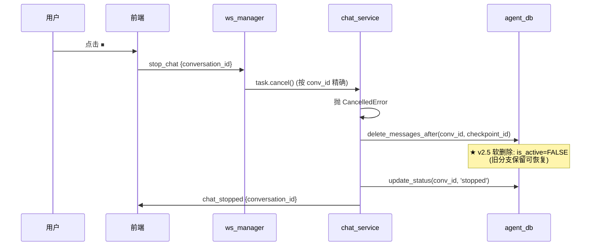
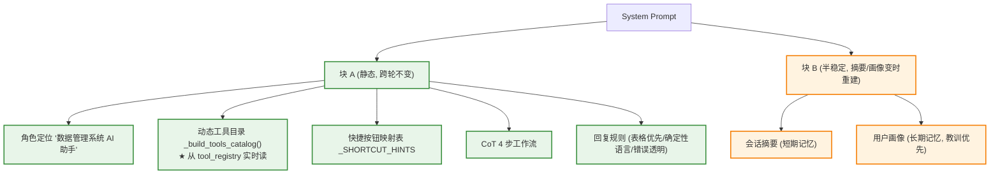
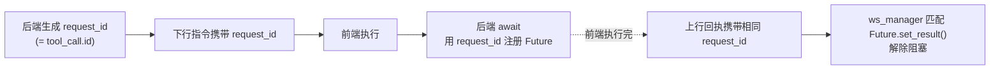
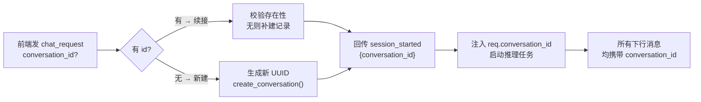

# 智能体层实施文档（ReAct 推理 + 三层记忆 + 执行闭环 + WebSocket）

> 本文是 [architecture.md](../../architecture.md) 的**实施配套**，聚焦"模型能力如何转化为可执行、可回滚的业务流程"。
> 智能体层是系统的应用承载，采用 ReAct 推理 + 工具编排，将大模型的"单次问答"升级为"持续推理、自主决策、长程协作"。

---

## 一、智能体层全景

智能体层由 **8 个核心部件** 构成，形成"推理 → 记忆 → 通信 → Prompt → 执行闭环"的完整闭环（正文 §二-§九 按部件 1-8 顺序展开）：

```mermaid
graph TB
    subgraph AGENT["智能体层 (backend/agent/)"]
        direction TB

        subgraph ENGINE["① ReAct 推理引擎"]
            SVC["chat_service.py<br/>推理循环·工具调度·停止回滚"]
        end

        subgraph MEM["② 三层记忆系统"]
            MCTX["memory/memory_context.py<br/>上下文构建·记忆编排"]
            MDB["memory/agent_db.py<br/>记忆数据库 CRUD"]
            MSC["memory/self_correction.py<br/>自纠捕捉器"]
            MTS["memory/task_state.py<br/>工作记忆状态卡 + 计划状态机"]
            MPT["memory/pattern_tracker.py<br/>重复操作偏好识别"]
        end

        subgraph PROMPT["③ System Prompt"]
            SP["prompt/system_prompt.py<br/>动态工具目录 + CoT + 显式缓存"]
        end

        subgraph WS["④ WebSocket 任务管理"]
            WSM["ws_manager.py<br/>连接·任务·阻塞等待"]
        end

        subgraph RT["⑧ 运行时隔离"]
            CV["runtime/context_vars.py<br/>ContextVar 多对话隔离"]
        end

        subgraph LOOP["⑤ 执行闭环与验证"]
            OBS["runtime/observation_builder.py<br/>Observation 增强"]
            VW["team/verification_worker.py<br/>确定性验证 (不调 LLM)"]
            VS["team/validation_stage.py<br/>验证阶段编排"]
            RP["team/repair_policy.py<br/>failure_type → repair_plan"]
            TM["team/task_manager.py<br/>worker 派发"]
            RW["team/report_worker.py<br/>报告 worker"]
        end

        subgraph SKILL["⑥ 技能编排"]
            SE["runtime/skill_execution.py<br/>技能契约 → plan 步骤"]
        end

        subgraph OBSERV["⑦ 可观测性"]
            DA["observability/decision_audit.py<br/>repair_plan 遵循审计"]
            PR["observability/parameter_repair.py<br/>参数级修正验证"]
            RS["observability/repair_success.py<br/>修正成功率观测"]
        end
    end

    MODEL["模型层 (LLM + 54 注册工具 / 33 暴露给 LLM)"]
    PLATFORM["平台层 (前端)"]

    SVC -->|"build_context"| MCTX
    SVC -->|"astream"| MODEL
    MCTX -->|"build_system_prompt"| SP
    MCTX -->|"load/persist"| MDB
    MSC -->|"沉淀教训"| MDB
    SVC -->|"set_runtime_context"| CV
    SVC <-->|"send_to_session / wait"| WSM
    WSM <-->|"WebSocket"| PLATFORM
    SVC -->|"tool_call"| OBS
    OBS -->|"注入验证"| VS
    VS -->|"调用"| VW
    VW -->|"失败"| RP
    SVC -->|"lookup_skill"| SE
    SE -->|"写 plan steps"| MTS
    SVC -->|"收尾审计"| DA
    DA --> PR
    DA --> RS

    classDef engine fill:#e8f5e9,stroke:#388e3c,stroke-width:2px
    classDef mem fill:#fff3e0,stroke:#f57c00,stroke-width:2px
    classDef prompt fill:#fce4ec,stroke:#c62828,stroke-width:2px
    classDef ws fill:#e3f2fd,stroke:#1976d2,stroke-width:2px
    classDef rt fill:#f3e5f5,stroke:#7b1fa2,stroke-width:2px
    classDef loop fill:#e0f7fa,stroke:#00838f,stroke-width:2px
    classDef skill fill:#f1f8e9,stroke:#558b2f,stroke-width:2px
    classDef observ fill:#faf5ff,stroke:#6b21a8,stroke-width:2px
    class SVC engine
    class MCTX,MDB,MSC,MTS,MPT mem
    class SP prompt
    class WSM ws
    class CV rt
    class OBS,VW,VS,RP,TM,RW loop
    class SE skill
    class DA,PR,RS observ
```



| 部件 | 关键文件 | 职责 |
|------|---------|------|
| ① ReAct 推理引擎 | `chat_service.py` | 流式 thinking + 工具调度循环 + 停止回滚 |
| ② 三层记忆系统 | `memory_context.py` + `agent_db.py` + `self_correction.py` + `task_state.py` | 工作/短期/长期记忆编排 + 自纠学习 + 计划状态机 |
| ③ System Prompt | `prompt/system_prompt.py` | 动态工具目录 + CoT + 显式缓存 |
| ④ WebSocket 管理 | `ws_manager.py` | 连接/任务管理 + 阻塞等待 + 多对话并行 |
| ⑤ 执行闭环与验证 | `team/` + `runtime/observation_builder.py` | 计划步骤 + 确定性验证 + repair_plan + worker 派发 |
| ⑥ 技能编排 | `runtime/skill_execution.py` + `model/skills/` | 技能契约选择 → plan 步骤映射 |
| ⑦ 可观测性 | `observability/` | repair_plan 遵循审计 + 参数修正 + 修复成功率 |
| ⑧ 运行时隔离 | `runtime/context_vars.py` | ContextVar 多对话隔离 |

---

## 二、核心部件 1：ReAct 推理引擎

**关键文件**：[`backend/agent/chat_service.py`](../../../backend/agent/chat_service.py)

### 2.1 实现方法：推理循环（无轮次上限）

```python
async def tool_chat_ws(req: ToolChatRequest, session_id: str,
                       ws_manager: WebSocketManager, checkpoint_id: int = None):
    """Agent 推理主循环入口"""

    # 🟢 准备阶段
    set_runtime_context(conv_id, user_id)                    # ContextVar 隔离
    llm = create_llm_with_tools(get_tools_for_llm())         # 绑定工具
    all_messages, new_start_idx = build_context_messages(    # 构建上下文
        conv_id, req.prompt, llm, user_id
    )

    # 🔁 推理循环 (while True, 不设轮次上限; iteration 仅日志计数)
    iteration = 0
    while True:
        iteration += 1
        ai_msg = await _stream_llm_thinking_ws(              # 流式输出 thinking
            llm, all_messages, session_id, conv_id, ws_manager
        )
        all_messages.append(ai_msg)

        if not ai_msg.tool_calls:                            # 无工具调用 → 回复完成
            break

        # 🔧 工具执行阶段
        for tool_call in ai_msg.tool_calls:
            tool = get_tool_by_name(tool_call["name"])
            result = tool.invoke(tool_call["args"])

            if result["type"] == "frontend_action":
                await ws_manager.send_to_session(session_id, {
                    "type": "frontend_action",
                    "request_id": tool_call["id"], ...
                })
                if result["wait_for_result"]:
                    # ★ 阻塞等前端回执 (图层控制类)
                    frontend_result = await ws_manager.wait_for_frontend_result(tool_call["id"])
                    result["frontend_result"] = frontend_result

            all_messages.append(ToolMessage(content=str(result), tool_call_id=tool_call["id"]))

    # ✅ 收尾阶段 (异步 fire-and-forget)
    persist_turn(conv_id, all_messages, new_start_idx)
    await maybe_summarize(conv_id, all_messages, new_start_idx)
    await scan_and_save_corrections(all_messages, user_id)   # 自纠学习
```

### 2.2 流式 thinking 推送

```python
async def _stream_llm_thinking_ws(llm, all_messages, session_id,
                                  conversation_id, ws_manager) -> AIMessage:
    """逐 chunk 推送 thinking, 累积合并为 AIMessage"""
    accumulated = []
    async for chunk in llm.astream(all_messages):
        # 每 chunk 检查 CancelledError (用户点停止)
        await asyncio.sleep(0)  # 让出控制权, 让 cancel 能介入
        if chunk.content:
            await ws_manager.send_to_session(session_id, {
                "type": "thinking", "conversation_id": conversation_id,
                "content": chunk.content,
            })
            accumulated.append(chunk.content)
    return AIMessage(content="".join(accumulated), tool_calls=...)
```

### 2.3 停止与回滚机制



**checkpoint_id**：本轮推理开始前 `get_last_message_id(conv_id)` 取得。停止时软删除该 id 之后的所有消息（v2.5 改为 `is_active=FALSE`，保留旧分支可恢复），保证下次续接的上下文干净。

### 2.4 关键设计要点

| 要点 | 实现 | 价值 |
|------|------|------|
| **工具异常不中断** | 捕获为 error ToolMessage 回流给 LLM 重试 | 单个工具失败不崩整个推理 |
| **反伪装成功三层防御** | 工具层 verification + Prompt 规则 + chat_service 兜底校验 | 防止 LLM 把失败说成成功 |
| **重工具持久化** | `HEAVY_TOOL_CATEGORIES` 触发 `ai_task` 记录 | 追踪状态/进度/IO，支持断点续算 |
| **停止不崩其他对话** | 按 `conversation_id` 精确取消，不 raise 传播 | 同 session 多对话并行安全 |
| **完成门拦截收尾** | `completion_gate.allowed=False` 时追加 SystemMessage 强制继续（`chat_service.py:1085`） | 未通过验证的步骤不能跳过 |

---

## 三、核心部件 2：三层记忆系统

**关键文件**：
- [`backend/agent/memory/memory_context.py`](../../../backend/agent/memory/memory_context.py) — 编排
- [`backend/agent/memory/agent_db.py`](../../../backend/agent/memory/agent_db.py) — 数据库 CRUD（数据结构见 [impl-data.md](../../data/impl-data.md) §3）
- [`backend/agent/memory/self_correction.py`](../../../backend/agent/memory/self_correction.py) — 自纠捕捉器

### 3.1 三层记忆对照

| 层级 | 表 | 范围 | 内容 | 触发/注入 |
|------|-----|------|------|-----------|
| 🔒 **长期** | `user_memory` | 跨会话 | 自纠学习教训（category=lesson，user_id='global'）+ 环境事实（envfact） | 自纠捕捉器自动沉淀；注入 system prompt |
| 📝 **短期** | `conversation_summary` | 会话内 | 旧消息的 LLM 压缩摘要（v2.5 多级：compress_level 0/1/2） | 两级压缩；注入 system prompt |
| 💾 **工作** | `message` | 近期 N 条 | 完整消息（含 tool_calls JSONB）+ DAG 分支 | 每轮 persist_turn；以消息列表喂 LLM |

> ★ **记忆策略（阶段 17）**：长期记忆**只保留错误案例与解决方案**，不再主动提取用户偏好/事实（`enable_preference_extraction` 默认 False）。偏好提取曾导致 86% 低价值空话污染 system prompt。

### 3.2 实现方法：上下文构建（build_context_messages）

```python
def build_context_messages(conv_id, user_prompt, llm, user_id) -> Tuple[List, int]:
    """返回 (all_messages, new_start_idx)"""

    # ① 加载三层记忆
    user_profile = build_user_profile_text(user_id)      # 长期记忆
    summary_data = load_summary(conv_id)                 # 短期记忆 {summary, summarized_upto}
    history = load_messages_since(                       # 工作记忆 (只取 summarized_upto 之后)
        conv_id, summary_data["summarized_upto"]
    )

    # ② 拼装 System Prompt
    system_prompt = build_system_prompt(
        conversation_summary=summary_data["summary"],
        user_profile=user_profile,
    )

    # ③ 拼装消息列表: [System] + history + [Human(user_prompt)]
    all_messages = [SystemMessage(system_prompt)] + history + [HumanMessage(user_prompt)]

    # ④ v2.5 fold_tool_messages (Level 0.5 可逆压缩)
    all_messages = fold_tool_messages(all_messages, keep_tail=settings.tool_message_keep_tail)
    # 旧工具结果折叠为 [已完成·工具名·摘要], 保留 tool_call_id 配对

    # ⑤ trim_messages 裁剪到 context_max_tokens (16000)
    all_messages = trim_messages(
        all_messages, max_tokens=settings.context_max_tokens,
        strategy="last", include_system=True, start_on="human",
    )
    # ★ trim 后强制补回 HumanMessage (防 system prompt 膨胀时丢失当前输入)

    new_start_idx = len(all_messages) - 1  # 本轮新增消息起点
    return all_messages, new_start_idx
```

**关键约束**：
- token 上限 `context_max_tokens`=16000，`trim_messages(strategy="last")` 保留近期
- 自定义 tiktoken 计数器（不能用 `token_counter=llm`，qwen-plus 会 NotImplementedError）
- `include_system=True`：system prompt 永不裁剪
- `start_on="human"`：从 human 轮切，不切断 `human→ai→tool→ai` 的完整配对

### 3.3 实现方法：收尾持久化（persist_turn + maybe_summarize）

```python
def persist_turn(conv_id, all_messages, new_start_idx) -> int:
    """持久化 all_messages[new_start_idx:] = 当前 Human + 所有 AI tool_calls + ToolMessage + AI 回复"""
    for msg in all_messages[new_start_idx:]:
        agent_db.append_message(conv_id, msg)   # ★ v2.5 自动取 active_leaf_node 作 parent

async def maybe_summarize(conv_id, all_messages, new_start_idx) -> bool:
    """v2.5 两级压缩"""
    total_tokens = _count_tokens(all_messages)
    if total_tokens < settings.summarize_threshold:   # 8000
        return False

    # Level 1: fold 工具消息 (可逆)
    save_summary(conv_id, folded_summary, summarized_upto, compress_level=1)

    # Level 2: 仍超 threshold × 1.5? → LLM 摘要 (不可逆)
    if total_tokens >= settings.summarize_threshold * settings.summary_level2_multiplier:
        summary = await _llm_summarize(old_messages)   # deepseek-v4-flash
        save_summary(conv_id, summary, summarized_upto, compress_level=2)
        delete_messages_upto(conv_id, summarized_upto)  # 物理删旧消息
```

### 3.4 实现方法：自纠学习（self_correction）

**核心痛点**：Agent 第一次总会遇到某些坑（如沙盒中文字体方块），自主修复后——这种"犯错→自纠"过程是宝贵经验，但旧架构不会沉淀，下次会话还会再踩一遍坑。

**检测 vs 沉淀 分工**：

```python
def detect_self_corrections(messages) -> List[dict]:
    """检测阶段: 纯规则, 零 LLM, O(n)
    模式: AIMessage(tool_calls=[X]) → ToolMessage(error)
            → AIMessage(thinking 含"修复/重试/重新") → AIMessage(tool_calls=[X']) → ToolMessage(success)
    """
    # 提取 7 字段原始素材: tool_name, error_msg, correction_thinking, fixed_by_tool, ...

async def _distill_correction_to_structured(correction) -> Optional[str]:
    """沉淀阶段: 调 LLM (deepseek-v4-flash) 提炼成五段结构化经验
    现象/根因/正确方法/验证信号/严重度
    ★ 无降级: 提炼失败/超时/缺字段 → 跳过不入库 (宁缺毋滥)
    """

async def save_lesson_to_memory(correction) -> bool:
    """沉淀为全局教训 (user_id='global', category='lesson', 1 小时去重)"""

async def scan_and_save_corrections(messages, user_id) -> List[saved]:
    """一站式入口 (chat_service 在对话收尾 fire-and-forget 调用)"""
```

**记忆 value 格式**（固定五段，结构化文本）：
```
现象：失败时观察到的表象
根因：为什么会失败（本质归纳，非复述报错）
正确方法：
① 具体可执行步骤（工具名+参数）
② ...
验证信号：如何确认修复成功
严重度：high|medium|low
```

**闭环**：自纠 → LLM 提炼成五段 → 写记忆 → 下轮 system_prompt 注入（多行缩进）→ Agent 直接照做规避。

### 3.5 DB 不可用降级

`agent_db` 每个 CRUD 函数 `conn is None` 时短路返回 `None/[]/False`。上层 `memory_context._mem_fallback`（内存 dict）接管：工作记忆按「只留 HumanMessage + 最终 AIMessage」简化，跳过摘要与长期提取。**系统在无 DB 时仍可运行，只是丢失跨会话记忆能力。**

---

## 四、核心部件 3：System Prompt 与上下文缓存

**关键文件**：[`backend/agent/prompt/system_prompt.py`](../../../backend/agent/prompt/system_prompt.py)

### 4.1 Prompt 组成（拆成两块做显式缓存）



### 4.2 实现方法：动态工具目录

```python
def _build_tools_catalog() -> str:
    """从 tool_registry 实时读取, 按 category 分组
    每工具列出: 名称 + docstring 首行 + 参数签名
    ★ 永远与 llm.bind_tools() 注入的真实工具一致
    新增/删除工具后 prompt 自动同步, 无需改本文件
    """
    tools = get_all_tools()
    category_map = get_tool_category_map()
    for category, label in _TOOL_CATEGORY_LABELS.items():
        for name, tool in tools.items():
            if category_map[name] == category:
                # 列出工具名 + 描述 + 参数
```

### 4.3 实现方法：显式上下文缓存

```python
def build_system_prompt_blocks(conversation_summary, user_profile) -> list:
    """拆成两块 (Qwen 显式缓存最多 4 标记, 这里用 2 个收益最大)"""
    return [
        {"type": "text", "text": STATIC_TEXT,   # 块A: 角色+工具+映射+CoT+规则
         "cache_control": {"type": "ephemeral"}},  # 跨轮不变, 第2轮起按 10% 计费
        {"type": "text", "text": DYNAMIC_TEXT,   # 块B: 摘要+画像
         "cache_control": {"type": "ephemeral"}},  # 变化时仅本块缓存失效
    ]
```

- **块 A（静态）**：角色 + 工具目录 + 快捷映射 + CoT + 回复规则。跨轮一字不变，**第 2 轮起按 10% 计费**。
- **块 B（半稳定）**：会话摘要 + 用户画像。摘要/画像更新前稳定，变化时仅本块缓存失效重建。
- 工具的 JSON schema 由 `llm.bind_tools()` 注入，自动并入 system 前缀参与缓存。
- `enable_context_cache=false` 时退回纯字符串 prompt（DashScope 隐式缓存仍自动生效，命中按 20%）。

### 4.4 CoT 4 步工作流

| Step | 名称 | 关键动作 |
|------|------|---------|
| 1 | 意图识别与需求分析 | 解析输入，提取参数（layer_name/table_name/file_path），歧义则反问 |
| 2 | 工具决策与检索 | 从目录选最匹配的**一个**工具，优先参照快捷映射表；一次只调必要工具 |
| 3 | 结果处理与闭环反馈 | `frontend_action`+`wait_for_result=False` → 一句话确认；`data` 字段 → Markdown 表格呈现 |
| 4 | 自我修正与异常处理 | `type=error` 分析原因，参数错尝试修正重试（≤2 次），服务降级明确告知 |

---

## 五、核心部件 4：WebSocket 任务管理

**关键文件**：[`backend/agent/ws_manager.py`](../../../backend/agent/ws_manager.py)

### 5.1 实现方法：连接/任务/阻塞等待

```python
class WebSocketManager:
    def __init__(self):
        self.connections: Dict[str, WebSocket] = {}                  # session → WS
        self.pending_events: Dict[str, asyncio.Event] = {}           # request_id → Event
        self.frontend_results: Dict[str, Dict] = {}                  # request_id → 结果
        self.active_tasks: Dict[str, Dict[str, asyncio.Task]] = {}   # session → {conv_id → task}
```

**核心机制：request_id 配对**



> **为什么重要**：一条对话中 LLM 连续调 3 个 `frontend_action`，后端有 3 个并发 `await`。`request_id` 确保每个回执精确唤醒对应的 `await`，不串号。**SSE 做不到这一点**（单向通道无回执），这是项目用 WebSocket 而非 SSE 的根本原因。

**阻塞等待实现**：

```python
async def wait_for_frontend_result(self, request_id: str, timeout=None) -> Dict:
    """阻塞等待前端回传 tool_result"""
    event = asyncio.Event()
    self.pending_events[request_id] = event
    await asyncio.wait_for(event.wait(), timeout=timeout or settings.ws_frontend_result_timeout)
    return self.frontend_results.pop(request_id)
```

### 5.2 多对话并行（v2.1）

```python
def register_task(self, session_id, conversation_id, task):
    """注册推理任务 (供 stop_chat 取消)"""
    self.active_tasks.setdefault(session_id, {})[conversation_id] = task

def cancel_task(self, session_id, conversation_id=None) -> int:
    """按 conv_id 精确取消; 不传则取消该 session 全部"""
    if conversation_id:
        self.active_tasks[session_id][conversation_id].cancel()
    else:
        for task in self.active_tasks[session_id].values():
            task.cancel()

def get_active_conversations(self, session_id) -> List[str]:
    """查询当前活跃对话列表"""
```

- 同一 WebSocket 连接可同时运行多个对话的推理任务
- 前端缓冲：未注册回调的对话消息暂存 `pendingMessages`，打开 Tab 时回放

---

## 六、核心部件 5：执行闭环与验证

> 架构原理详见 [architecture-agent.md §3 执行闭环与团队](architecture-agent.md)。本节聚焦实施方法。

**关键文件**：
- [`backend/agent/memory/task_state.py`](../../../backend/agent/memory/task_state.py) — 计划状态机
- [`backend/agent/runtime/observation_builder.py`](../../../backend/agent/runtime/observation_builder.py) — Observation 增强
- [`backend/agent/team/verification_worker.py`](../../../backend/agent/team/verification_worker.py) — 确定性验证
- [`backend/agent/team/repair_policy.py`](../../../backend/agent/team/repair_policy.py) — 修复策略表
- [`backend/agent/team/validation_stage.py`](../../../backend/agent/team/validation_stage.py) — 验证编排

### 6.1 实现方法：计划状态机（task_state.py）

**核心设计**：plan 是内存 dict，持久化复用 `task_type='agent_plan'` 的 ai_task（不新增表）。

```python
def create_plan_state(conversation_id, goal) -> dict:
    """创建无步骤的计划, 完成门默认关闭
    入参: conversation_id, goal
    出参: {plan_id, status:'running', steps:[], completion_gate:{allowed:False}, ...}
    """

def append_plan_step(plan, goal, executor, inputs=None,
                     expected_outputs=None, required=True, tool_name="") -> dict:
    """追加 pending 步骤并刷新完成门
    入参: executor ∈ {main_agent, tool, verification_agent, report_agent}
    出参: 新增的 step 对象 (含 step_id, evidence:[], repair_plan:{})
    """

def start_tool_step(plan, tool_name, tool_args=None) -> dict:
    """LLM 发起 tool_call 时调用 (chat_service.py:1161)
    方法: 优先激活技能预置的同名 pending/blocked 步骤; 无匹配则追加
    出参: 进入 running 状态的步骤
    """

def apply_step_observation(plan, step_id, tool_name, tool_result) -> dict:
    """工具执行+验证完成后调用 (chat_service.py:1339)
    方法: 按 agent_validation.status 转换 step 状态
      passed   → completed
      failed/warning → blocked (保存 repair_plan)
      unverified → failed
    出参: 更新后的步骤 (含追加的 evidence 记录)
    """

def can_finalize_plan(plan) -> Tuple[bool, str]:
    """完成门查询: 必需步骤全部 completed 才允许收尾
    入参: plan=None 时返回 (True, ...) (普通问答不受约束)
    """
```

### 6.2 实现方法：验证注入（observation_builder + validation_stage）

```python
def build_observation_tool_message(tool_call, tool_result, conversation_id) -> ToolMessage:
    """构造 ToolMessage 前统一增强 (observation_builder.py:52)
    方法:
      1. 若 should_run_validation_stage(tool_result) → run_validation_stage
      2. apply_validation_to_tool_result → 写回 tool_result.agent_validation
      3. 拼装验证摘要 + repair_plan 进 ToolMessage.content
    出参: 含 agent_validation 字段的 ToolMessage
    """

# validation_stage.py
def should_run_validation_stage(tool_result) -> bool:
    """判断是否需验证: 有 error / 有 verification / data 含产物路径"""

def run_validation_stage(tool_result) -> dict:
    """调 verification_agent.run_verification, 返回 {status, checks, repair_plan}"""
```

### 6.3 实现方法：确定性验证（verification_worker.py）

```python
def run_verification(payload) -> dict:
    """纯规则验证, 不调 LLM (verification_worker.py:102)
    方法 (校验链):
      1. 检查 result.get('error')                      → :125
      2. 读取 result.get('verification') (工具自带)     → :138
      3. 对产物路径调 verify_by_path                    → :143
         (文件存在/矢量有效/报告页数, 实现在 _verification.py)
    出参: {status: passed|failed|warning, repair_plan: {...}}
    """
```

### 6.4 实现方法：修复策略（repair_policy.py）

```python
def build_repair_plan(failure_type, context=None) -> dict:
    """failure_type → 修复策略查表 (repair_policy.py:115)
    支持的 failure_type (13 类):
      tool_error, missing_input_file, missing_sandbox_file,
      missing_vector_artifact, missing_artifact, empty_or_tiny_artifact,
      empty_vector, incomplete_shapefile_zip, unreadable_artifact,
      permission_or_path_error, invalid_arguments,
      insufficient_evidence, unknown_failure
    出参: {failure_type, root_cause_hint, next_action, recommended_tool,
           parameter_changes, fallback_tools, stop_condition, recommendation}
    """
```

### 6.5 实现方法：完成门拦截（chat_service.py）

```python
# chat_service.py:1085-1106
# 当 LLM 想给最终回复 (无 tool_calls), 但 completion_gate 禁止时
plan_allowed, reason = can_finalize_plan(plan)
if not plan_allowed and not waiting_for_user:
    all_messages.append(SystemMessage(
        content=f"完成门禁止: {reason}。必须继续执行 next_action 或 repair_plan。"
    ))
    continue  # 强制回到推理循环
```

---

## 七、核心部件 6：技能编排

**关键文件**：
- [`backend/agent/runtime/skill_execution.py`](../../../backend/agent/runtime/skill_execution.py) — 契约 → plan 映射
- [`backend/model/skills/`](../../../backend/model/skills/) — 技能定义（markdown 契约）
- [`backend/model/tools/skill_tools.py`](../../../backend/model/tools/skill_tools.py) — `lookup_skill` 工具

### 7.1 实现方法：技能契约映射（skill_execution.py）

```python
def apply_skill_selection_to_plan(plan, skill_contract) -> dict:
    """把技能契约转为 plan 步骤 (skill_execution.py:9)
    方法:
      1. validate_skill_contract 契约质量门 (→ :32)
      2. 把 contract.steps 逐个 append_plan_step (executor='tool') (→ :43)
      3. 写回 plan.selected_skill / skill_fallback_rule / skill_verification_rules (→ :52)
    出参: 更新后的 plan
    """
```

**触发点**（`chat_service.py:1345`）：当 `tool_name == "lookup_skill"` 时调用，并把 accepted_lessons 注入（`chat_service.py:1213`）。

**已注册技能**（3 个，定义在 `backend/model/skills/`）：
- `wf1-segment-visualize-report.md` — 分割 + 可视化 + 报告
- `wf2-change-detection-visualize-report.md` — 变化检测 + 可视化 + 报告
- `wf4-upload-geoserver-display.md` — 上传 GeoServer + 显示

> 技能步骤直接映射为 plan step（executor=`tool`），不引入独立的 stage / skill_step 类。

---

## 八、核心部件 7：可观测性

**关键文件**：
- [`backend/agent/observability/decision_audit.py`](../../../backend/agent/observability/decision_audit.py) — repair_plan 遵循审计
- [`backend/agent/observability/parameter_repair.py`](../../../backend/agent/observability/parameter_repair.py) — 参数级修正验证
- [`backend/agent/observability/repair_success.py`](../../../backend/agent/observability/repair_success.py) — 修正成功率

### 8.1 实现方法：决策审计（decision_audit.py）

```python
# decision_audit.py — repair_plan 遵循审计
def record_decision(trace) -> None:
    """把 (输入上下文, 期望决策, 实际工具调用, 实际 observation, 是否遵循 repair_plan)
    写入 JSONL 审计日志, 供离线评估 llm_follow_rate"""
```

> 注：`runtime/retry_guard.py:29` `build_retry_signature`（防机械重试）已定义但**未被调用**，当前防重复失败靠 plan step status + repair_plan。命名统一与激活建议见 [engineering-gap-analysis.md](engineering-gap-analysis.md) §2.2。

---

## 九、核心部件 8：运行时隔离（ContextVar）

**关键文件**：[`backend/agent/runtime/context_vars.py`](../../../backend/agent/runtime/context_vars.py)

### 6.1 实现方法

```python
from contextvars import ContextVar

# 多对话隔离的核心: 每个推理任务有独立的 ContextVar 值
_current_conversation_id: ContextVar[str] = ContextVar("conversation_id", default="")
_current_user_id: ContextVar[str] = ContextVar("user_id", default="study_user")
_current_session_id: ContextVar[str] = ContextVar("session_id", default="")

def set_runtime_context(conversation_id, user_id, session_id=None):
    """推理循环开始时设置 (每个 asyncio.Task 独立副本)"""
    _current_conversation_id.set(conversation_id)
    _current_user_id.set(user_id)
    if session_id:
        _current_session_id.set(session_id)
```

> **价值**：同一进程内多个对话并行推理时，各任务的 `conversation_id` / `user_id` 互不干扰。工具函数内部可通过 `get_current_conversation_id()` 获取当前上下文，无需层层传参。

---

## 十、HTTP 端点（会话/项目管理）

**关键文件**：[`backend/main.py`](../../../backend/main.py)

智能体层的状态管理通过 HTTP REST 暴露（推理本身走 WebSocket）：

### 7.1 项目管理

| 方法 | 路径 | 对应 `agent_db` 函数 |
|------|------|---------------------|
| `GET` | `/api/v1/projects` | `list_projects(user_id)` |
| `POST` | `/api/v1/projects` | `create_project(user_id, name, description, folder_path)` |
| `PATCH` | `/api/v1/projects/{id}` | `update_project(id, name, description)` |
| `DELETE` | `/api/v1/projects/{id}` | `delete_project(id)` |

### 7.2 会话管理

| 方法 | 路径 | 对应函数 |
|------|------|---------|
| `GET` | `/api/v1/conversations` | `list_conversations(user_id, project_id)` |
| `GET` | `/api/v1/conversations/{id}/messages` | `get_conversation_messages(id)` |
| `PATCH` | `/api/v1/conversations/{id}` | `update_conversation(id, title, project_id)` |
| `DELETE` | `/api/v1/conversations/{id}` | `delete_conversation(id)` (CASCADE 消息) |
| `POST` | `/api/v1/conversations/{id}/fork` | `fork_from_node(id, node_id)` ★v2.5 |
| `POST` | `/api/v1/conversations/{id}/regenerate` | fork + 返回状态 ★v2.5 |
| `GET` | `/api/v1/conversations/{id}/branches` | 分支信息 ★v2.5 |

### 7.3 任务监控

| 方法 | 路径 | 用途 |
|------|------|------|
| `GET` | `/api/v1/tasks` | 任务列表（status/conv_id 过滤） |
| `GET` | `/api/v1/tasks/{id}` | 任务详情（input/output/error） |
| `GET` | `/api/v1/tasks/{id}/logs` | 执行日志（info/warning/error） |

### 7.4 conversation_id 贯通机制



> **关键**：每条下行 WS 消息都带 `conversation_id`，前端据此路由到对应对话 Tab，这是多对话并行的基础。

---

## 十一、关键设计原则总结

1. **ReAct 循环**：LLM 驱动的推理循环（`while True`，不设轮次上限，由用户手动停止兜底），流式 thinking + 工具调度，直到给出最终回复。
2. **三层记忆协同**：工作（近期消息）/ 短期（摘要）/ 长期（教训）三层，自动 trim + 阈值摘要 + 自纠学习沉淀。
3. **多级上下文压缩**（v2.5）：Level 0.5 fold（可逆）→ Level 1 drop（可逆）→ Level 2 LLM 摘要（不可逆），精细化降 token。
4. **消息分支 DAG**（v2.5）：Git-like node_id/parent_id/is_active，支持"回到第 N 轮重新问"，旧分支软删除保留。
5. **自纠学习闭环**：规则检测（零 LLM）→ LLM 提炼五段教训（无降级，宁缺毋滥）→ 注入 system prompt → 下轮规避。
6. **WebSocket 全双工**：request_id 配对实现"后端发指令→前端执行→回传结果"闭环，SSE 无法替代。
7. **多对话并行**：同连接多对话，按 conversation_id 精确取消，ContextVar 隔离运行时上下文。
8. **显式上下文缓存**：system prompt 拆静态/半稳定两块，第 2 轮起按 10% 计费，命中率 40-60%。
9. **执行闭环**（部件 6-8）：计划步骤 → 确定性 verification_agent 校验 → failure_type 映射 repair_plan → 完成门拦截未验证收尾；受控 worker（验证/报告）按白名单分工，主控 Agent 始终是唯一决策中心。

> 平台层（前端指令执行 + OpenLayers 地图容器）详见 [impl-platform.md](../../platform/impl-platform.md)。
