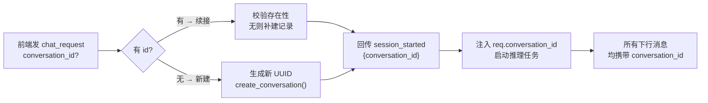
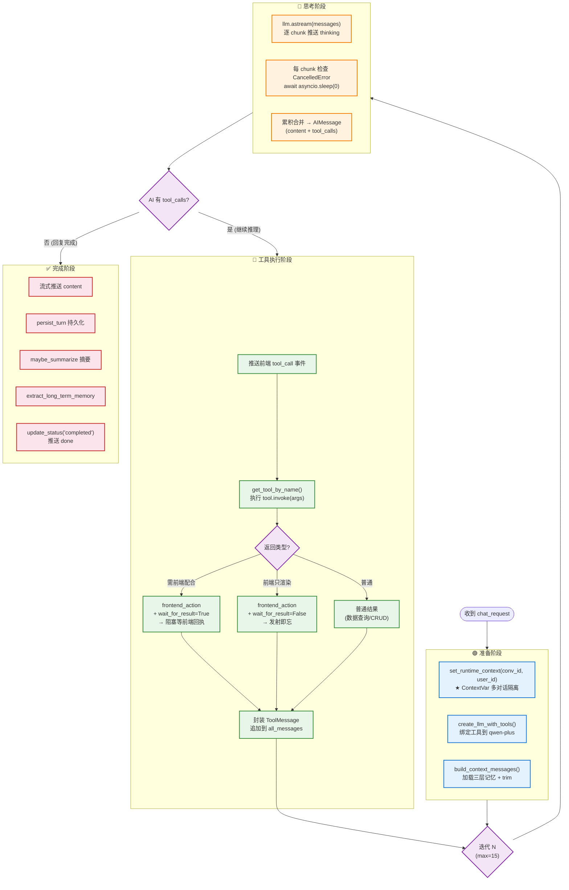
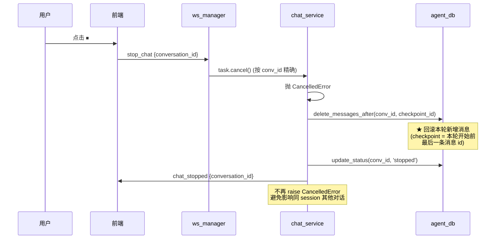
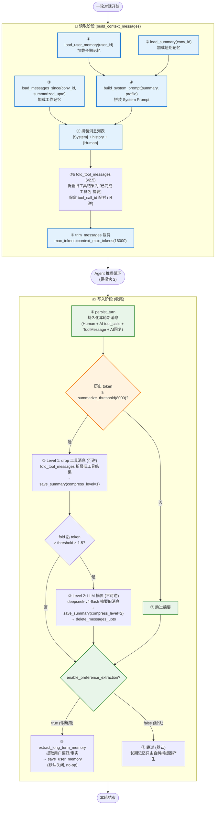
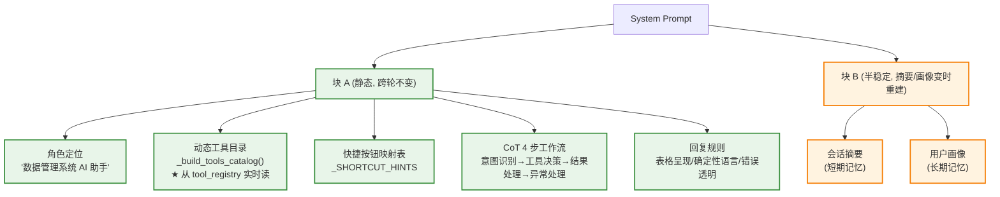
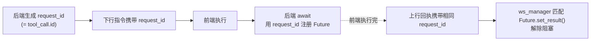

# Agent 核心架构（会话 / ReAct 推理 / 记忆 / Prompt / WebSocket）

> 本文是 [architecture.md](./architecture.md) 的子文档，聚焦 Agent 内核机制。系统总览见总纲。

---

## 1. 会话与项目管理

> **一句话**：项目 → 会话 → 消息的三级组织，通过 HTTP REST 管理元数据，通过 `conversation_id` 贯通前后端多轮对话。

**关键文件**：
- [`backend/main.py`](../backend/main.py) — HTTP 端点
- [`backend/agent/memory/agent_db.py`](../backend/agent/memory/agent_db.py) — `project` / `conversation` CRUD

### 1.1 数据模型

```
project (1) ──< conversation (1) ──< message (N)
                       │
                       └──(1:1)── conversation_summary
user_memory (跨会话, 独立)
```

| 表 | 关键字段 | 说明 |
|----|---------|------|
| `project` | `id`, `user_id`, `name`, `description` | 项目组织；删除时 conversation 的 project_id 置 NULL（不级联） |
| `conversation` | `id`, `user_id`, `project_id` (FK), `title`, **`status`**, `created_at`, `updated_at` | 会话元数据 |
| `message` | `id`, `conversation_id` (FK CASCADE), `role`, `content`, **`tool_calls` (JSONB)**, `tool_call_id`, `name` | 完整消息（含工具调用链） |

### 1.2 会话状态机

`conversation.status` 取值：

| 状态 | 含义 | 触发时机 |
|------|------|---------|
| `active` | 默认/进行中 | 新建会话 |
| `background` | 后台运行 | 同 session 下其他对话活跃时 |
| `completed` | 已完成 | 推理循环正常结束（`done` 事件） |
| `stopped` | 已停止 | 用户 `stop_chat` 触发回滚 |

### 1.3 HTTP 端点

**项目管理**：

| 方法 | 路径 | 对应 `agent_db` 函数 |
|------|------|---------------------|
| `GET` | `/api/v1/projects` | `list_projects(user_id)` |
| `POST` | `/api/v1/projects` | `create_project(user_id, name, description)` |
| `PATCH` | `/api/v1/projects/{id}` | `update_project(id, name, description)` |
| `DELETE` | `/api/v1/projects/{id}` | `delete_project(id)` |

**会话管理**：

| 方法 | 路径 | 对应 `agent_db` 函数 |
|------|------|---------------------|
| `GET` | `/api/v1/conversations` | `list_conversations(user_id, project_id)` |
| `GET` | `/api/v1/conversations/{id}/messages` | `get_conversation_messages(id)` |
| `PATCH` | `/api/v1/conversations/{id}` | `update_conversation(id, title, project_id)` |
| `DELETE` | `/api/v1/conversations/{id}` | `delete_conversation(id)` (CASCADE 消息) |

### 1.4 `conversation_id` 贯通机制



> **关键**：每条下行 WS 消息都带 `conversation_id`，前端据此路由到对应对话 Tab，这是多对话并行的基础（见模块 6）。

---

## 2. Agent ReAct 推理引擎

> **一句话**：LLM 驱动的 ReAct 循环——流式输出思考 → 检测工具调用 → 执行工具 → 结果回灌 LLM → 直到给出最终回复或达迭代上限。

**关键文件**：[`backend/agent/chat_service.py`](../backend/agent/chat_service.py)

### 2.1 推理循环流程图



### 2.2 核心接口

```python
# chat_service.py — 入口
async def tool_chat_ws(req: ToolChatRequest, session_id: str,
                       ws_manager: WebSocketManager, checkpoint_id: int = None)
# 每轮调 LLM 的流式方法
async def _stream_llm_thinking_ws(llm, all_messages, session_id,
                                  conversation_id, ws_manager) -> AIMessage
```

```python
class ToolChatRequest(BaseModel):
    prompt: str
    model: str = "qwen-plus"
    temperature: float = 0.7
    conversation_id: Optional[str] = None
    user_id: str = "study_user"
    multi_round: bool = True
```

### 2.3 停止与回滚机制



> **`checkpoint_id`**：本轮推理开始前 `agent_db.get_last_message_id(conv_id)` 取得。停止时删除该 id 之后的所有消息，保证下次续接的上下文干净。

---

---

## 4. 三层记忆系统

> **一句话**：工作记忆（近期消息）/ 短期记忆（会话摘要）/ 长期记忆（**只沉淀错误案例+解决方案**，偏好/事实提取默认关闭）三层协同，自动 trim 裁剪、阈值摘要、**犯错自纠自动沉淀为全局教训**（融入长期记忆）。

**关键文件**：
- [`backend/agent/memory/memory_context.py`](../backend/agent/memory/memory_context.py) — 编排
- [`backend/agent/memory/agent_db.py`](../backend/agent/memory/agent_db.py) — 记忆数据库 CRUD
- [`backend/agent/memory/self_correction.py`](../backend/agent/memory/self_correction.py) — **自纠捕捉器（阶段 13 新增）**
- [`backend/agent/memory/task_state.py`](../backend/agent/memory/task_state.py) — 工作记忆状态卡
- [`backend/agent/memory/pattern_tracker.py`](../backend/agent/memory/pattern_tracker.py) — 重复操作偏好识别

### 4.1 三层记忆对照

| 层级 | 表 | 范围 | 内容 | 触发/注入 |
|------|-----|------|------|-----------|
| 🔒 **长期** | `user_memory` | 跨会话 | 🎓**自纠学习教训** (category=`lesson`/`workflow`) + 🧩**环境事实** (category=`envfact`，如沙盒字体知识)；偏好/事实提取**默认关闭** | 自纠捕捉器 `scan_and_save_corrections` 沉淀教训（唯一自动写入源）；`extract_and_save_long_term_memory` 受 `enable_preference_extraction` 开关控制（默认 False）；**注入 system prompt（教训优先显示）** |
| 📝 **短期** | `conversation_summary` | 会话内 | 旧消息的 LLM 压缩摘要（**v2.5 多级**：compress_level 0/1/2） | **v2.5 两级**：Level 1 fold 工具消息（可逆）→ Level 2 LLM 摘要（threshold×1.5 触发，不可逆）；注入 system prompt 会话摘要 |
| 💾 **工作** | `message` | 近期 N 条 | 完整消息（含 `tool_calls` JSONB）+ **v2.5 node_id/parent_id/is_active（DAG 分支）** | 每轮 `persist_turn` 持久化；**v2.5 加载前 `fold_tool_messages` 折叠旧工具结果**；以消息列表 history 形式喂给 LLM |

> ★ 教训不再作为独立的第四层记忆，而是融入长期记忆层。自纠捕捉器 (`self_correction.py`) 写入 `user_memory` 表 (user_id='global', category='lesson')，`build_user_profile_text()` 合并到用户画像文本中一起注入 system prompt。

### 4.1.1 自纠学习（融入长期记忆，阶段 13 新增）

**核心痛点**：Agent 在沙盒画图时第一次总会遇到中文字体方块问题，自主调 `run_shell_command` 装字体后重画——这种"犯错→自纠"过程是宝贵经验，但旧架构不会沉淀，下次会话还会再踩一遍坑。

**检测模式**（轻量规则，不调 LLM，O(n) 扫消息）：

```
AIMessage(tool_calls=[X]) → ToolMessage(error)
  → AIMessage(thinking 含"修复/重试/重新"等关键词)
  → AIMessage(tool_calls=[X' 或相关工具]) → ToolMessage(success)
```

**关键函数**（[`self_correction.py`](../backend/agent/memory/self_correction.py)）：

```python
# 检测自纠事件 (规则, 零 LLM, O(n))
detect_self_corrections(messages) → List[{tool_name, error_msg, correction_thinking, fixed_by_tool, severity}]

# ★ LLM 提炼成五段结构化经验 (现象/根因/正确方法/验证信号/严重度)
_distill_correction_to_structured(correction) → Optional[str]   # 失败返回 None

# 沉淀为全局教训 (user_id='global', category='lesson', 1 小时去重)
# ★ async: 内部调 LLM 提炼; 无降级: 提炼失败则跳过不入库
async save_lesson_to_memory(correction) → bool

# 一站式入口 (chat_service 在对话收尾 fire-and-forget 调用)
async scan_and_save_corrections(messages, user_id) → List[saved]
```

**检测 vs 沉淀 分工**（阶段 20 重构）：
- **检测阶段**（`detect_self_corrections`）：纯规则、零 LLM、O(n)，只负责"识别发生过自纠"，提取 7 字段原始素材
- **沉淀阶段**（`save_lesson_to_memory` + `_distill_correction_to_structured`）：调 LLM（deepseek-v4-flash）把原始素材**提炼成结构化经验**。规则拼接只能记录"发生了什么"（现象层），提炼不出"正确做法是什么"（根因+方法层），后者需语义归纳

**记忆 value 格式**（固定五段，结构化文本）：
```
现象：失败时观察到的表象
根因：为什么会失败（本质归纳，非复述报错）
正确方法：
① 具体可执行步骤（工具名+参数）
② ...
验证信号：如何确认修复成功
严重度：high|medium|low
```

**设计要点**：
- 检测零 LLM（实时、零成本），沉淀调 LLM（后台异步，不阻塞用户，20s 超时）
- ★ **无降级**：LLM 提炼失败/超时/返回缺字段 → **跳过不入库**，保证 `user_memory` 里只有结构化格式，宁缺毋滥
- 全局共享（教训写 `user_id='global'`，所有用户复用）
- 严重度过滤（只记 high/medium；low 跳过）
- 去重（同类错误 1 小时内只记一次）
- 单写 lesson（不再双写 workflow，旧的双写内容重复已废弃清理）
- 闭环：自纠 → LLM 提炼成五段 → 写记忆 → 下轮 system_prompt 注入（多行缩进）→ Agent 直接照做规避

### 4.1.2 记忆策略调整：只记错误+解决方案（阶段 17）

**核心原则**：长期记忆**只保留错误案例与解决方案**，不再主动提取用户偏好/事实。

**背景与决策依据**（数据驱动）：
- 旧设计下 `extract_and_save_long_term_memory` 每轮收尾用 LLM 从对话中挖"用户偏好/事实"，存入 `user_memory`（category=`preference`/`fact`）。
- 实测诊断（`scripts/diag_user_memory.py`）：21 条记忆中 **18 条（86%）是低价值空话**，如"偏好表格展示""经常进行变化检测分析"（后者其实是系统主功能，等于没说）。这些"用户画像"不仅零信息量，还污染 system prompt（占 ~700 tokens）。
- 而自纠捕捉器产出的 3 条 `lesson`（错误+方案）**100% 有价值**，且与"偏好提取"讲的同一件事（如沙盒中文字体问题）被两条路径重复记录、内容重叠。

**改动**：
1. **新增开关** `enable_preference_extraction`（`config.py`，**默认 False**，环境变量 `ENABLE_PREFERENCE_EXTRACTION=true` 可恢复，仅诊断用）。开关关闭时 `extract_and_save_long_term_memory` 直接返回 0，`chat_service` 两处调用点（正常完成 / 对话停止）成为 no-op。
2. **注入过滤**：`build_user_profile_text` 默认只注入 `lesson` / `workflow` / `envfact` 三类，屏蔽 `preference` / `entity` / `fact`。开关开启时恢复全量注入。
3. **新增 `envfact` 类别**：容纳"环境事实"——本质是"遇到过的问题+已知答案"（如沙盒字体知识），从旧的 `fact` 类迁移而来。
4. **数据清理**（`scripts/cleanup_user_memory.py`，带 DRY-RUN + 全量备份）：删除 16 条 preference/entity/废话 fact，迁移 2 条沙盒字体 fact → envfact，保留 3 条 lesson。**注入 system prompt 的长期记忆从 ~2813 chars (~1406 tokens) 降至 ~2021 chars (~1010 tokens)，且 100% 真信号。**

**改后记忆的唯一主动学习路径**：
```
自纠捕捉器 (规则, 零 LLM 成本)
  → user_memory (category=lesson/workflow, user_id=global)
  → build_user_profile_text 注入 system prompt
  → 下轮 Agent 规避同类错误
```

> 偏好/事实提取路径保留代码与开关，但默认关闭。若未来需要恢复用户画像（如个性化场景），设 `ENABLE_PREFERENCE_EXTRACTION=true` 即可。

### 4.1.3 教训记忆结构化（阶段 20）

**核心原则**：教训记忆必须是**结构化、可执行的经验**（现象/根因/正确方法/验证信号/严重度五段），而非"执行过程流水账"。

**背景与决策依据**：
- 旧 `save_lesson_to_memory` 用**纯规则拼接** value，把 `error_msg + correction_thinking + 修复动作` 缝成一段中文流水账（每字段还 `[:200]` 截断）。
- 实测注入文本中，旧 lesson 混杂了 LLM 原始思考（`🔍 根因诊断`）、markdown 符号、原始 JSON 参数，**无法直接照做复用**。
- 根本原因：规则能记录"发生了什么"（现象层），提炼不出"正确做法是什么"（根因+方法层）——后者需要语义归纳，正是 LLM 该做的事。
- 同期发现旧设计**双写 lesson + workflow**（一次自纠写两条，内容 80% 重复），徒增 token。

**改动**（3 文件）：
1. **`self_correction.py`**：
   - 新增 `_DISTILL_LESSON_SYSTEM` 提示词 + `async _distill_correction_to_structured(correction)`：复用 `_get_long_term_memory_llm`（deepseek-v4-flash）+ `_parse_json_items`，把 7 字段素材提炼成五段 JSON → 结构化文本
   - `save_lesson_to_memory` 改 `async`，value 改由 LLM 提炼生成；★ **无降级**：提炼失败（超时 20s / 缺字段 / 解析错误）→ 跳过不入库
   - `scan_and_save_corrections` 改 `async`，删掉 `save_workflow_to_memory` 双写（函数标 deprecated 保留）
2. **`chat_service.py`**：`_async_self_correction_scan` 调用处加 `await`
3. **`memory_context.py`**：`build_user_profile_text` 注入端改多行缩进（value 换行保留 + 后续行 4 空格），让五段在 system prompt 里清晰成块
4. **数据清理**：删除 4 条旧格式记录（1 workflow + 3 流水账 lesson），保留 2 条 envfact；备份 `backup_user_memory_structured_*.json`

**改后记忆写入链路**：
```
detect_self_corrections (规则, 零 LLM, O(n))
  → correction dict (7 字段原始素材)
  → _distill_correction_to_structured (LLM 提炼, deepseek-v4-flash, 20s 超时)
    ├─ 成功 (五段齐全) → 结构化文本 → user_memory (lesson, global)
    └─ 失败/缺字段 → ★ 跳过, 不入库 (不降级)
  → build_user_profile_text 多行缩进注入 system prompt
  → 下轮 Agent 照做规避
```

**验证**：toggle_layer 场景实测，LLM 准确还原出五段结构（现象/根因/正确方法①②/验证信号/严重度）；字段校验对残缺/空值/非法严重度全部判失败跳过；注入端多行缩进正常。

### 4.2 记忆编排时序图



### 4.3 核心接口

```python
# memory_context.py — 编排（核心 5 函数）
def build_context_messages(conversation_id, user_prompt, llm,
                           user_id="study_user") -> Tuple[List[BaseMessage], int]
# 返回 (all_messages, new_start_idx)，new_start_idx 标记本轮新消息起点
# ★ v2.5: trim 前 fold_tool_messages 折叠旧工具结果 (可逆 Level 0.5)

def fold_tool_messages(messages, keep_tail=3) -> List[BaseMessage]   # ★ v2.5 新增
# 可逆压缩: 把旧工具结果折叠为 [已完成·工具名·摘要], 保留 tool_call_id 配对
# build_context_messages 在 trim 前调用

def persist_turn(conversation_id, all_messages, new_start_idx) -> int
# 持久化 all_messages[new_start_idx:]，返回写入条数

async def maybe_summarize(conversation_id, all_messages, new_start_idx) -> bool
# ★ v2.5 多级压缩: Level 1 fold(可逆) → Level 2 LLM 摘要(threshold×1.5, 不可逆)
# 返回是否触发任意级别

async def extract_and_save_long_term_memory(conversation_id, user_id,
                                            all_messages, new_start_idx) -> int
# 提取用户偏好/事实写入 user_memory；★ 默认关闭 (enable_preference_extraction=False)，返回 0

def build_user_profile_text(user_id) -> str
# 加载长期记忆注入 system prompt；★ 默认只注入 lesson/workflow/envfact，屏蔽 preference/entity/fact
```

```python
# agent_db.py — 记忆数据库 CRUD（节选，全部函数见 README 数据库设计）
# 连接与降级
def agent_db_available() -> bool
def init_schema() -> bool                      # 幂等建表 (含 v2.5 增量列)
@contextmanager def get_conn()                 # yield conn 或 None

# 消息（工作记忆）★ v2.5: 含 node_id/parent_id/is_active (DAG 分支)
def append_message(conversation_id, msg, parent_node_id=None) -> bool
# ★ v2.5: 自动取 active_leaf_node 作 parent, 更新 leaf
def load_messages(conversation_id, limit=None) -> List[BaseMessage]   # ★ 过滤 is_active=TRUE
def load_messages_since(conversation_id, since_id, limit=None) -> List[BaseMessage]  # ★ 过滤 is_active
def get_conversation_messages(conversation_id, limit=200) -> List[Dict]  # ★ 返回 node_id/parent_id, 过滤 is_active
def delete_messages_upto(conversation_id, upto_id) -> int   # 摘要后清理 (物理删)
def delete_messages_after(conversation_id, after_msg_id) -> int  # ★ v2.5 改软删除 (is_active=FALSE)
def get_last_message_id(conversation_id) -> Optional[int]   # ★ 只算 active 消息

# 消息分支 (v2.5 Git-like DAG) ★ 新增
def fork_from_node(conversation_id, parent_node_id) -> Optional[str]
# 从指定节点开新分支: 隐藏后续兄弟 (is_active=FALSE), 更新 active_leaf_node
def get_active_leaf_node(conversation_id) -> Optional[str]  # 当前分支叶子 node_id
def soft_delete_branch_after(conversation_id, after_msg_id) -> int  # 软删除 (停止回滚)

# 摘要（短期）★ v2.5: 加 compress_level 参数
def save_summary(conversation_id, summary, summarized_upto, compress_level=0) -> bool  # UPSERT
def load_summary(conversation_id) -> Optional[Dict]  # 返回 {summary, summarized_upto, compress_level}

# 用户记忆（长期）
def save_user_memory(user_id, key, value, category="preference") -> bool  # UPSERT
def load_user_memory(user_id, category=None) -> List[Dict]
def delete_user_memory(user_id, key) -> bool
```

### 4.4 DB 不可用降级

`agent_db` 每个 CRUD 函数都用 `with get_conn() as conn:` 包裹，`conn is None` 时短路返回 `None/[]/False`。上层 `memory_context._mem_fallback`（内存 dict）接管：工作记忆按「只留 HumanMessage + 最终 AIMessage」简化，跳过摘要与长期提取。**系统在无 DB 时仍可运行，只是丢失跨会话记忆能力。**

### 4.5 `message.tool_calls` 的关键设计

用 JSONB 完整保存工具调用结构（含 `name/args/id`）。下次 `load_messages` → `_pack_message` 用 `_decode_tool_calls` 零损耗还原 `AIMessage(tool_calls=[...])`。**这是多轮工具编排的基础**——LLM 能看到上轮调了哪个工具、传了什么参数、拿到什么结果。

### 4.6 消息分支（v2.5 Git-like DAG）

> ★ **阶段 16（v2.5）**：message 表加 `node_id`(UUID)/`parent_id`(UUID)/`is_active`(BOOL)，conversation 表加 `active_leaf_node`(UUID)，支持"回到第 N 轮重新问""编辑消息重新生成"，旧分支保留不丢失。

**数据模型**（每个会话一棵 DAG，首条消息 parent_id=NULL 为根）：

```
conv_id=A
  msg1 (root, parent=NULL) ── msg2 ── msg3 ── msg4 [active_leaf]
                                          └── msg5(隐藏) ── msg6(隐藏)  ← fork 后的旧分支
```

**分支操作**：
- **fork**：从指定节点开新分支 → 隐藏该节点之后的所有 active 消息（is_active=FALSE）→ 更新 active_leaf_node
- **regenerate**：fork + 用原/新 prompt 重新发对话（新消息自动挂到 active_leaf_node）
- **停止回滚**：`delete_messages_after` 已改为软删除（is_active=FALSE），旧分支保留可恢复

**加载语义**：所有 `load_messages*` / `get_conversation_messages` 只返回 `is_active=TRUE` 的消息（当前分支）。喂给 LLM 的历史永远是当前分支链。

**HTTP 端点**（3 个）：
- `POST /api/v1/conversations/{id}/fork` — 从指定 node_id 分叉
- `POST /api/v1/conversations/{id}/regenerate` — fork + 返回状态供前端重发
- `GET /api/v1/conversations/{id}/branches` — 分支信息（active/hidden 计数）

**前端**：human 消息气泡加 `↻ 重新生成` 按钮（hover 显示），调 fork → 重载 UI → 重新发对话。所有消息气泡挂 `data-node-id`。

**历史迁移**：48 条现存消息自动转为单链 DAG（5 会话，首条 parent=NULL），零风险幂等迁移。

---

## 5. System Prompt 与上下文缓存

> **一句话**：动态生成工具目录（与 `bind_tools` 实时同步）+ CoT 4 步工作流 + 快捷按钮映射，拆成「静态块 + 半稳定块」做显式缓存降本。

**关键文件**：[`backend/agent/prompt/system_prompt.py`](../backend/agent/prompt/system_prompt.py)

### 5.1 Prompt 组成



### 5.2 动态工具目录

`_build_tools_catalog()` 从 `tool_registry.get_all_tools()` 实时读取，按 `category` 分组，每工具列出：名称 + docstring 首行 + 参数签名。**永远与 `llm.bind_tools()` 注入的真实工具一致**，新增/删除工具后 prompt 自动同步，无需改本文件。

### 5.3 显式上下文缓存

```python
def build_system_prompt_blocks(conversation_summary, user_profile) -> list:
    """拆成两块（Qwen 显式缓存最多 4 标记，这里用 2 个收益最大）"""
    return [
        {"type": "text", "text": STATIC_TEXT,   # 块A: 角色+工具+映射+CoT+规则
         "cache_control": {"type": "ephemeral"}},  # 跨轮不变，命中率最高，第2轮起按10%计费
        {"type": "text", "text": DYNAMIC_TEXT,   # 块B: 摘要+画像
         "cache_control": {"type": "ephemeral"}},  # 变化时仅本块缓存失效
    ]
```

- **块 A（静态）**：角色 + 工具目录 + 快捷映射 + CoT + 回复规则。跨轮一字不变，**第 2 轮起按 10% 计费**。
- **块 B（半稳定）**：会话摘要 + 用户画像。摘要/画像更新前稳定，变化时仅本块缓存失效重建。
- 工具的 JSON schema 由 `llm.bind_tools()` 注入，自动并入 system 前缀参与缓存，无需单独标记。
- `enable_context_cache=false` 时退回纯字符串 prompt（DashScope 隐式缓存仍自动生效，命中按 20%）。
- `stream_usage=true` 是缓存命中率日志的前提（缓存 token 数只在流式 usage_metadata 暴露）。

### 5.4 CoT 4 步工作流

| Step | 名称 | 关键动作 |
|------|------|---------|
| 1 | 意图识别与需求分析 | 解析输入，提取参数（layer_name/table_name/file_path 等），歧义则反问 |
| 2 | 工具决策与检索 | 从目录选最匹配的**一个**工具，优先参照快捷映射表；一次只调必要工具 |
| 3 | 结果处理与闭环反馈 | `frontend_action`+`wait_for_result=False` → 一句话确认；`data` 字段 → Markdown 表格呈现 |
| 4 | 自我修正与异常处理 | `type=error` 分析原因，参数错尝试修正重试（≤2 次），服务降级明确告知 |

---

## 6. WebSocket 双向通信

> **一句话**：全双工通道，`request_id` 配对实现「后端发指令 → 前端执行 → 回传结果」闭环；支持同连接多对话并行。

**关键文件**：
- [`backend/agent/ws_manager.py`](../backend/agent/ws_manager.py) — 连接/任务管理 + 阻塞等待
- [`frontend/core/ws-chat.js`](../frontend/core/ws-chat.js) — 事件分发 + 多对话路由

> 完整协议表、时序图、三层架构详见 [communication.md](./communication.md)。

### 6.1 核心机制：`request_id` 配对



**为什么重要**：一条对话中 LLM 连续调 3 个 `frontend_action`，后端有 3 个并发 `await`。`request_id` 确保每个回执精确唤醒对应的 `await`，不串号。

### 6.2 阻塞等待实现

```python
# chat_service.py — 工具执行时
if tool_result["type"] == "frontend_action" and tool_result["wait_for_result"]:
    request_id = tool_call_id
    await ws_manager.send_to_session(session_id, {
        "type": "frontend_action", "request_id": request_id, ...
    })
    # ★ 后端在此阻塞，直到前端回传 tool_result
    frontend_result = await ws_manager.wait_for_frontend_result(request_id)
    tool_result["frontend_result"] = frontend_result
    # 继续把带结果的 tool_result 喂给 LLM 做下一轮推理
```

> **SSE 做不到这一点**（单向通道无回执），这是项目用 WebSocket 而非 SSE 的根本原因。

### 6.3 多对话并行（v2.1）

```python
class WebSocketManager:
    connections: Dict[str, WebSocket]                              # session → WS
    pending_events: Dict[str, asyncio.Event]                       # request_id → Event
    frontend_results: Dict[str, Dict]                              # request_id → 结果
    active_tasks: Dict[str, Dict[str, asyncio.Task]]               # session → {conv_id → task}
```

- 同一 WebSocket 连接可同时运行多个对话的推理任务
- `cancel_task(session_id, conversation_id)` 支持按 conv_id 精确取消，不传则取消全部
- `get_active_conversations(sid)` 查询当前活跃对话列表
- 前端缓冲：未注册回调的对话消息暂存 `pendingMessages`，打开 Tab 时回放

---
