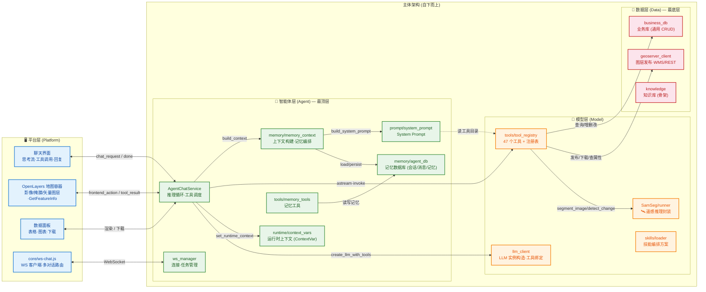

# Agent-Flow-Study 架构文档

> 本文档按 **10 大功能模块** 组织，完整梳理项目的架构、接口与流程。
> 通信机制（WebSocket 事件 + 前端执行层）详见 [communication.md](platform/communication.md)。
> 所有图表使用 Mermaid 语法，可在 GitHub / VSCode Mermaid 插件 / Typora 直接渲染。

---

## 系统总述（数据-模型-智能体-服务平台 四板块）

Agent-Flow-Study 以 **「数据—模型—智能体—服务平台」** 为主线，通过数据层、模型层、智能体层、服务平台四大板块的分层解耦与协同联动，形成从底层数据资源组织、核心智能能力构建到上层自然语言交互的完整闭环。

- **数据层**是基础资源层，为系统提供高质量的空间与业务语料：通过 GeoServer 统一发布 WMS/WFS/WCS 栅格与矢量图层服务，PostgreSQL 业务库以「表名作参数」的通用 CRUD 承载业务数据，并预留知识库骨架（pgvector/向量服务可选），为上层的认知与推理提供可检索、可操作的数据底座。
- **模型层**作为智能中枢，实现了「通用地学大模型 + 专业技能模型」的融合：一方面通过 Qwen（DashScope 兼容 OpenAI 接口）提供统一的认知、推理与生成能力；另一方面将 GeoServer 操作、数据库 CRUD、图层控制、**SamSeg 遥感分割/变化检测**（基于 SAM 3 的 SegEarth-OV3）、沙盒代码执行、数据预处理、报表生成等专业能力封装为 **47 个标准化工具（10 大类）**，以装饰器注册表统一调度，并辅以 Markdown 技能方案承载长任务编排——使模型能力既可被自然语言调用，又可按需演进扩展。
- **智能体层**作为应用承载，采用 **ReAct 推理 + 工具编排**机制，将模型能力转化为可执行、可回滚的业务流程：流式输出思维链、最多 15 轮的工具调度循环、按 `conversation_id` 精确停止与消息回滚，配合**三层记忆系统**（工作记忆存完整工具调用链、短期记忆做会话摘要、长期记忆只沉淀**犯错自纠的错误案例与解决方案**，偏好/事实提取默认关闭以避免噪声）与显式上下文缓存，将大模型的「单次问答」升级为「持续推理、自主决策、长程协作」的智能体行为。
- **服务平台**面向终端用户，通过 **WebSocket 全双工通道**实现前后端协同：以 `request_id` 配对完成「智能体发指令→前端执行渲染→回传结果」的闭环，支持同一连接多对话并行；前端集成聊天交互、**OpenLayers 地图容器**（影像/掩膜/矢量图层叠加 + WMS 图层 + GetFeatureInfo 属性弹窗 + 颜色图注）、数据表格面板，以及任务日志监控。

整体架构强调**数据驱动与模型、智能并重**：通过引入大模型与智能体技术，实现地理空间信息处理从**传统菜单/脚本驱动**向**认知驱动与决策驱动**的转型——用户用一句自然语言即可完成图层发布、数据库增删改查、遥感分析等跨系统的多步操作，智能体自主推理、调用工具、在地图/表格/影像上渲染结果。

| 板块 | 对应代码 | 关键组件 | 体现的「转型」 |
|------|---------|---------|---------------|
| 数据层 | `backend/data/` | GeoServer 客户端、业务库通用 CRUD、知识库骨架 | 数据资源组织 |
| 模型层 | `backend/model/` | LLM 客户端（Qwen）、47 工具注册表、SamSeg 推理封装、技能方案 | 认知/推理/生成 + 专业技能融合 |
| 智能体层 | `backend/agent/` | ReAct 推理引擎、三层记忆、System Prompt+缓存、WS 任务管理、运行时隔离 | 规则驱动 → 认知/决策驱动 |
| 服务平台 | `frontend/` | 聊天 UI、OpenLayers 地图容器、数据面板、WS 多对话路由 | 上层应用服务闭环 |

---

## 目录（按架构层拆分）

> 本文档为**总纲**，只讲系统总述 + 总架构图。各层细节见子文档：

| 子文档 | 覆盖内容 | 章节 |
|--------|---------|------|
| [architecture-agent.md](agent/core/architecture-agent.md) | Agent 内核：会话管理 / ReAct 推理 / 三层记忆 / System Prompt / WebSocket | §1 §2 §4 §5 §6 |
| [architecture-tools.md](model/architecture-tools.md) | 工具系统：注册机制 / 10 大分类 47 工具 / 统一 Tool Result Schema | §3 |
| [architecture-samseg.md](model/architecture-samseg.md) | SamSeg 遥感分析：分割/变化检测/矢量化/VLM 判读（runner·geoio·visualize 三层） | §10 |
| [architecture-platform.md](platform/architecture-platform.md) | 平台层：前端指令执行(OpenLayers 地图容器) / GeoServer 数据集成 / 技能编排 / 视觉设计 | §7 §8 §9 §11 附 |

---

## 总架构图（三层 + 平台）

整张图按 **智能体 / 模型 / 数据** 三层（主体自下而上）+ **平台层**（右侧承载用户交互）组织。

> **★ 三层重构 (2026-06)**：按职责重新归位。
> - **agent 层**：prompt + 推理流水线 + 连接/任务管理 + **记忆（编排 + agent_db 数据库）** + 上下文隔离 + 记忆工具
> - **model 层**：**工具箱**（25 个具体服务/API 工具，含 SamSeg 遥感分析）+ 注册表 + LLM 客户端 + 技能文档 + SamSeg 推理封装
> - **data 层**：GeoServer + 业务库 + 知识库（骨架）

**依赖方向**（自上而下承载，**不反向**）：

| 方向 | 说明 |
|------|------|
| agent → model | 推理调 LLM、读工具注册表 ✅ |
| agent 内部自洽 | memory ↔ agent_db ↔ memory_tools 均在 agent 层 ✅ |
| model → data | 工具调业务库/GeoServer ✅ |
| data → 无上层 | 仅读 config ✅ |
| platform ↔ agent | 通过 WebSocket 双向交互（见 [communication.md](platform/communication.md)） |

---

---

> ★ 架构演进：本文档随项目迭代持续更新。最新两轮重大改造见 [PROGRESS.md](./PROGRESS.md)：
>   - 阶段 21：OpenLayers 地图容器（撤销阶段 14 移除地图引擎的决策）
>   - 阶段 22：矢量渲染增强 + 端到端测试体系
