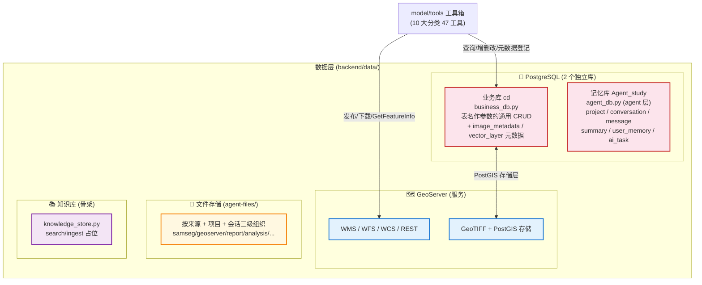
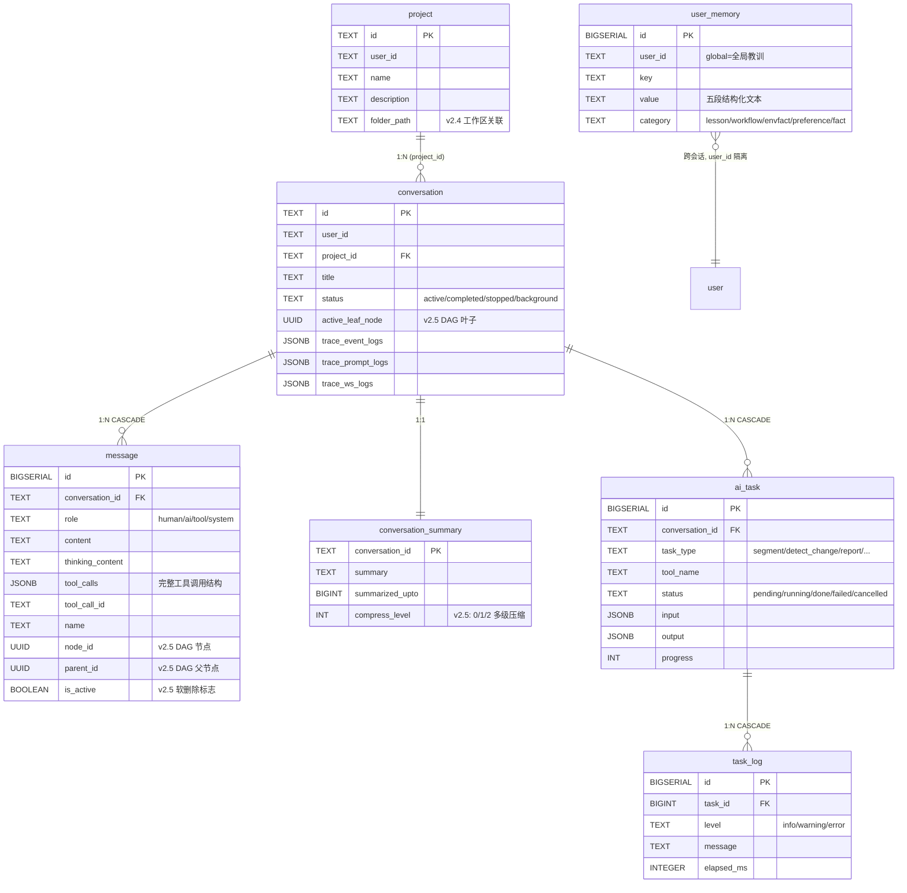

# 数据层实施文档（数据管理）

> 本文是 [architecture.md](./architecture.md) 的**实施配套**，按「核心部件 → 实现方法」组织，回答"怎么把数据层搭起来、接进系统"。
> 数据层是整个系统的底座，向上为模型层工具提供可检索、可操作的数据资源。

---

## 一、数据层全景

数据层由 **3 个异构数据源 + 1 套文件存储** 构成，彼此职责清晰、互不耦合：



| 数据源 | 物理载体 | 访问模块 | 作用 | 默认配置 |
|--------|---------|---------|------|---------|
| **业务库** | PostgreSQL `cd` | `backend/data/business_db.py` | 业务数据 + 空间元数据 | `localhost:5432/cd` |
| **记忆库** | PostgreSQL `Agent_study` | `backend/agent/memory/agent_db.py` | 会话/消息/摘要/长期记忆/任务 | `localhost:5432/Agent_study` |
| **GeoServer** | GeoServer 服务 | `backend/data/geoserver_client.py` | 图层发布/下载/查询（WMS/WFS/REST） | `http://localhost:8080/geoserver` |
| **文件存储** | 本地磁盘 `agent-files/` | `backend/model/tools/_paths.py` | 上传原图 + 各类产物落盘 | `项目根/agent-files/` |
| **知识库** | 骨架（未实现） | `backend/data/knowledge/knowledge_store.py` | RAG 检索占位 | — |

> ★ **架构归属说明**：`agent_db.py` 代码物理位于 `backend/agent/memory/`（记忆是智能体自身状态，归 agent 层），但其**数据库实例**是数据层的组成部分。本文从"数据底座"视角梳理记忆库的表结构，运行机制详见 [impl-agent.md](./impl-agent.md)。

---

## 二、核心部件 1：业务数据库（cd 库）

**关键文件**：[`backend/data/business_db.py`](../backend/data/business_db.py)

### 2.1 实现方法

**① 连接池管理（懒初始化 + 优雅降级）**

```python
# business_db.py 核心模式: psycopg2.ThreadedConnectionPool
_pool = None  # 模块级单例池

def _get_pool():
    """懒初始化连接池; psycopg2 缺失/连接失败返回 None"""
    global _pool
    if _pool is not None:
        return _pool
    psycopg2, pool_mod = _get_psycopg2()  # 延迟导入, 缺失返回 (None, None)
    if psycopg2 is None:
        return None
    _pool = pool_mod.ThreadedConnectionPool(
        minconn=1, maxconn=5,
        host=settings.postgres_host, port=settings.postgres_port,
        dbname=settings.postgres_db,  # 默认 "cd"
        user=settings.postgres_user, password=settings.postgres_password,
    )
    return _pool

@contextmanager
def get_conn():
    pool = _get_pool()
    if pool is None:
        yield None      # ★ 不可用时 yield None, 调用方短路返回
        return
    conn = pool.getconn()
    try:
        yield conn
    finally:
        pool.putconn(conn)
```

> **降级原则（贯穿全数据层）**：每个 CRUD 函数都用 `with get_conn() as conn:` 包裹，`conn is None` 时短路返回 `None/[]/False`。上层工具据此返回 `type=error`。**系统在无 DB 时仍可启动，只是丢失数据读写能力。**

**② 表无关通用 CRUD（表名作参数）**

业务库最核心的设计是**表无关**——不绑定任何具体业务表，表名作为运行时参数传入：

```python
def insert_data(table_name: str, data: Dict[str, Any]) -> Dict[str, Any]:
    # f'INSERT INTO "{table_name}" ({cols_sql}) VALUES ({placeholders})'
    # 参数化: %s 占位防 SQL 注入, 列名/表名用双引号包裹防大小写问题

def update_data(table_name, data, condition=None, condition_params=None) -> Dict
def delete_data(table_name, condition=None, condition_params=None) -> Dict
def read_table_data(table_name, limit=100, offset=0) -> DataFrame
def get_table_statistics(table_name) -> Dict    # 行数/列信息/数值列统计
def list_tables(schema="public") -> List[Dict]
```

> **安全要点**：表名和列名只能用字符串拼接（SQL 不支持参数化标识符），因此**所有表名/列名入口处必须用双引号包裹**（`f'"{table_name}"'`），值参数严格用 `%s` 占位。LLM 传入的表名会直接进 SQL，由 prompt 规则约束 + 工具层校验兜底。

### 2.2 业务专用表：空间元数据（image_metadata / vector_layer）

除了通用 CRUD，业务库还维护两张**专用元数据表**，对接"空间数据入库 / 元数据管理"清单：

**表结构**（`ensure_business_schema()` 幂等建表）：

| 表 | 主键/唯一 | 关键字段 | 索引 |
|---|---|---|---|
| `image_metadata` | `id BIGSERIAL` / `layer_name UNIQUE` | `workspace, file_path, sensor, acquired_at, resolution, width, height, band_count, bbox_geom(GEOMETRY POLYGON 4490), bbox_jsonb(JSONB 兜底), srid` | GIST 空间索引 + `acquired_at` 时间索引 + `uploaded_at` 索引 |
| `vector_layer` | `id BIGSERIAL` / `layer_name UNIQUE` | `workspace, kind(rule/change/administrative), file_path, source_task_id, bbox_geom, bbox_jsonb, feature_count, total_area_m2, attrs(JSONB)` | GIST 空间索引 + `(kind, created_at)` 复合索引 |

**PostGIS 双模式（关键降级设计）**：

```python
_postgis_available = None  # 缓存: None=未检测

def postgis_available() -> bool:
    """惰性检测一次, 缓存结果"""
    # SELECT postgis_version() 成功 → True

def ensure_business_schema() -> bool:
    has_postgis = postgis_available()
    bbox_geom_col = "bbox_geom GEOMETRY(POLYGON, 4490)," if has_postgis else ""
    cur.execute(f"""
        CREATE TABLE IF NOT EXISTS image_metadata (
            ... {bbox_geom_col} ...
            bbox_jsonb JSONB  # ★ 无论是否有 PostGIS 都建 JSONB 列兜底
        )""")
    if has_postgis:
        cur.execute("CREATE INDEX ... USING GIST (bbox_geom)")
```

- **PostGIS 可用**：用 `GEOMETRY(POLYGON, 4490)` + GIST 索引，空间查询走 `ST_Intersects`（数据库内过滤，高效）
- **PostGIS 不可用**：只用 `JSONB` 存 bbox，空间查询走 Python 内存过滤（`_bbox_intersects`）
- **SRID 统一为 4490**（CGCS2000），非 4490 的 bbox 上传时用 `ST_Transform` 自动转换

### 2.3 元数据登记与时空检索

**登记函数（UPSERT 语义，幂等）**：

```python
register_image_metadata(layer_name, workspace, file_path, bbox, srid, resolution,
                        width, height, band_count, acquired_at, sensor) -> Optional[int]
# ON CONFLICT (layer_name) DO UPDATE; 返回 id

register_vector_layer(layer_name, kind, workspace, file_path, source_task_id, bbox,
                      feature_count, total_area_m2, attrs) -> Optional[int]
```

**检索函数（#4 元数据管理的核心）**：

```python
query_images_by_time(start=None, end=None, limit=100) -> List[Dict]   # 时间检索
query_images_by_region(bbox, limit=100) -> List[Dict]                 # 空间检索
    # PostGIS: WHERE ST_Intersects(bbox_geom, ST_GeomFromText(%s, 4490))
    # 无 PostGIS: Python 内存过滤 bbox_jsonb
list_image_metadata(limit=100) / list_vector_layers(kind=None, limit=100)
```

**自动登记触发点**（工具调用成功后自动写元数据）：
- `main.py::upload_samseg_images`：上传 GeoTIFF 后调 `_try_register_image_metadata`（仅地理影像生效，PNG/JPG 跳过）
- `data_tools.py::upload_raster_layer` / `upload_shapefile_layer`：成功后自动登记

> ★ **SRID 修复**：`rasterio.crs.to_epsg()` 对 Web Mercator Auxiliary Sphere 返回 None，用 bounds 数值范围兜底（`>180` 必为投影坐标 → 3857），PostGIS `ST_Transform` 正确转换。

---

## 三、核心部件 2：Agent 记忆库（Agent_study 库）

**关键文件**：[`backend/agent/memory/agent_db.py`](../backend/agent/memory/agent_db.py)

### 3.1 实现方法（与业务库同构，但完全隔离）

记忆库复用业务库的成熟模式（独立连接池 + 懒初始化 + 优雅降级），但**物理隔离**：

- **独立连接池** `_agent_pool`（`minconn=1, maxconn=3`，比业务池小，记忆读写低频）
- **独立配置** `agent_db_*`（`config.py` 预留字段，默认 `localhost:5432/Agent_study`）
- **职责分离**：业务库存业务数据（高频读写），记忆库存对话历史（低频持久化）

```python
# agent_db.py — 与 business_db.py 同构的连接池
_pool = pool_mod.ThreadedConnectionPool(
    minconn=1, maxconn=3,
    host=settings.agent_db_host, port=settings.agent_db_port,
    dbname=settings.agent_db_name,  # "Agent_study"
    ...
)
# 降级: agent_db 不可用 → 所有函数返回 None/[]/False → 上层 memory.py 回退内存 dict
```

> **设计理由**：两个库职责完全不同（业务 vs 对话），分开部署可独立扩容/备份；学习场景下共用一个 PG 实例也行，但逻辑上保持表名空间隔离。

### 3.2 记忆库表结构全景（7 张表）

`init_schema()` 幂等建表，表间通过外键级联：



| 表 | 职责 | v2.5 关键字段 |
|---|---|---|
| `project` | 项目组织（user_id + name） | `folder_path`（关联本地文件夹，UPSERT 复用） |
| `conversation` | 会话元数据 | `status`（状态机）+ `active_leaf_node`（DAG 叶子）+ `trace_*`（trace 快照） |
| `message` | 完整消息（含工具调用链） | `node_id`/`parent_id`/`is_active`（Git-like DAG 分支）+ `thinking_content`（思考轨迹） |
| `conversation_summary` | 短期记忆（每会话至多 1 条） | `compress_level`（0/1/2 多级压缩） |
| `user_memory` | 长期记忆（跨会话） | `category=lesson`（自纠教训，user_id='global'） |
| `ai_task` | 重工具任务持久化 | `input/output`（JSONB）+ `progress` + 时间戳 |
| `task_log` | 任务执行日志 | `level` + `elapsed_ms` |

### 3.3 消息持久化映射（核心设计）

`message` 表用 JSONB 完整保存工具调用结构，下轮可零损耗还原：

| LangChain 消息类型 | `role` | `content` | `tool_calls`(JSONB) | `tool_call_id` | `name` |
|---|---|---|---|---|---|
| `HumanMessage` | human | ✓ | — | — | — |
| `AIMessage` | ai | ✓ | ✓（`[{name, args, id}]`） | — | — |
| `ToolMessage` | tool | ✓ | — | ✓ | ✓ |
| `SystemMessage` | system | ✓ | — | — | — |

**还原流程**：`load_messages` → `_pack_message` → `_decode_tool_calls`（JSONB → LangChain tool_calls 列表）→ `AIMessage(tool_calls=[...])`。**这是多轮工具编排的基础**——LLM 能看到上轮调了哪个工具、传了什么参数、拿到什么结果。

### 3.4 Schema 演进与历史迁移

记忆库经历了多轮增量改造，`init_schema()` 用 `ALTER TABLE ... ADD COLUMN IF NOT EXISTS` 保证幂等：

| 版本 | 新增字段 | 兼容处理 |
|---|---|---|
| v2.4 | `project.folder_path` | 唯一索引 `WHERE folder_path IS NOT NULL` |
| v2.5 | `message.node_id/parent_id/is_active` | `DEFAULT gen_random_uuid()` + 自动迁移 |
| v2.5 | `conversation.active_leaf_node` | `_migrate_message_nodes()` 补全历史数据 |
| v2.5 | `conversation_summary.compress_level` | `DEFAULT 0` |
| v2.5 | `conversation.status` | `DEFAULT 'active'` |

**历史迁移**（`_migrate_message_nodes()`，幂等）：
1. 给 `node_id IS NULL` 的消息生成 UUID
2. 用窗口函数 `LAG(node_id)` 按 `(conversation_id, id ASC)` 设 `parent_id`（首条为 NULL）
3. 给 `active_leaf_node IS NULL` 的会话设为最后一条 active 消息的 `node_id`

---

## 四、核心部件 3：GeoServer 客户端

**关键文件**：[`backend/data/geoserver_client.py`](../backend/data/geoserver_client.py)

### 4.1 实现方法

**① 认证与连通性**

```python
def _auth() -> HTTPBasicAuth:
    return HTTPBasicAuth(settings.geoserver_username, settings.geoserver_password)
    # 默认 admin/geoserver

def geoserver_available() -> bool:
    r = requests.get(f"{settings.geoserver_url}/rest/about/version.json", auth=_auth(), timeout=5)
    return r.status_code == 200
```

**② 工作空间策略（关键设计）**

`settings.geoserver_workspace` 默认**留空**——不绑定具体业务工作空间，由工具层按裸名自动搜索所有工作空间定位：

```python
def resolve_layer_name(name: str) -> Optional[str]:
    """裸名 → 全工作空间搜索 → workspace:layername"""
    if ':' in name:
        return name                    # 已含 workspace 前缀, 直接返回
    all_layers = list_all_layers()
    matches = [l for l in all_layers if l["name"] == name]
    if len(matches) == 1:
        return matches[0]["full_name"] # 唯一匹配
    if len(matches) > 1:
        return matches[0]["full_name"] # 多匹配取第一个 (可优化为让用户选)
    return None
```

> **展示层白名单**：`list_services()` 仅返回名称以 `cd` / `samseg` 开头的工作空间（大小写不敏感），过滤掉系统工作空间减少干扰。边界：仅作用于展示接口，不影响 `resolve_layer_name` 等图层操作的全量查询。

### 4.2 核心接口矩阵

| 类别 | 函数 | 协议 | 用途 |
|---|---|---|---|
| **连通性** | `geoserver_available()` | REST | 版本检查 |
| **图层发现** | `list_workspaces()` / `list_layers(ws)` / `list_all_layers()` | REST | 工作空间/图层枚举 |
| | `list_services()` | REST | 白名单过滤的服务清单 |
| | `get_layer_bbox(name)` | WMS GetCapabilities | 递归解析 Layer 子树取 bbox |
| | `get_layer_type(name)` | REST | raster/vector 判定 |
| | `resolve_layer_name(name)` | REST | 裸名→全名 |
| **栅格操作** | `sample_raster(name, ...)` | WMS GetMap | 采样为 numpy array + 统计 |
| | `download_raster(name, ...)` | WMS GetMap (geotiff) | 下载为 GeoTIFF |
| | `upload_raster(path, ...)` | REST PUT coveragestores | 发布栅格图层 |
| **矢量操作** | `upload_shapefile(path, ...)` | REST PUT datastores | 发布矢量（ZIP 打包） |
| | `upload_geojson(path, ...)` | REST PUT datastores | 发布 GeoJSON |
| | `download_shapefile(name, ...)` | WFS GetFeature (SHAPE-ZIP) | 下载为 Shapefile |
| | `download_geojson(name, ...)` | WFS GetFeature (json) | 下载为 GeoJSON |
| **属性查询** | `get_feature_info(name, bbox, w, h, i, j)` | WMS GetFeatureInfo | 点击像素查属性 |
| **图层管理** | `delete_layer(name, ws, delete_store)` | REST DELETE | 删图层（栅格/矢量端点不同） |
| **样式管理** | `_ensure_samseg_edge_style()` / `_ensure_samseg_polygon_style()` | REST | 确保 #2C6FBD 线/面样式 |

### 4.3 发布名回查机制（关键坑点）

```python
def _get_datastore_published_name(workspace, store_name) -> Optional[str]:
    """上传后回查真实发布的 featuretype 名"""
    # ★ GeoServer PUT .../datastores/{store}/file.shp 时,
    #   发布的 featuretype 名 = .shp 文件名 (而非 store 名)
    #   若两者不一致, 直接返回 store 名会导致 WMS 请求不存在的图层
```

**所有上传函数**（`upload_shapefile` / `upload_geojson`）都遵循"上传 → 回查 `published_name` → 以 `published_name` 为准返回"的契约。调用方不能假定 `layer_name == 期望的 layer_name`，必须用返回的 `published_name`。

### 4.4 GetCapabilities BBOX 解析（健壮性设计）

`get_layer_bbox()` 的健壮性体现在三层兜底：

1. **workspace 专属端点优先**：`/{workspace}/wms` 失败回退全局 `/wms`
2. **递归遍历 Layer 子树**：匿名容器层（无 `<Name>`）不跳过，递归搜索子层
3. **bbox 字段优先级**：`EX_GeographicBoundingBox`（WGS84）→ `BoundingBox`（匹配 EPSG:4326）→ 平扫兜底

---

## 五、核心部件 4：文件存储（agent-files/）

**关键文件**：[`backend/config.py`](../backend/config.py) + [`backend/model/tools/_paths.py`](../backend/model/tools/_paths.py)

### 5.1 实现方法：统一目录约定（v2.4）

所有文件统一收归 `agent-files/`，按**数据来源作为一级目录**组织：

```
agent-files/
├── samseg/send/{conv_id}/                       → 遥感: 用户上传原图 (单层, 不带 proj)
├── samseg/generate/{proj_id}/{conv_id}/          → 遥感: 分割/变化检测结果
├── samseg/vector/{proj_id}/{conv_id}/            → 遥感: 矢量 GeoJSON
├── geoserver/generate/{proj_id}/{conv_id}/       → GeoServer: 图层下载
├── report/{proj_id}/{conv_id}/                   → 报表/导出产物
├── analysis/{proj_id}/{conv_id}/                 → 掩膜分析产物
├── preprocess/{proj_id}/{conv_id}/               → 预处理产物
└── sandbox/workspace/{proj_id}/{conv_id}/        → 沙盒: 代码执行工作区 (会话级隔离)
```

**兜底常量**（无项目→`_default`，无会话→`_anonymous`）。

**文件名规范**：`{conv8}_{语义}_{rand4}.{ext}`（去 stem 叠加 + 时间戳，避免套娃过长）。

### 5.2 配置项

```python
# config.py — 每个来源一个独立配置项, 均派生自 file_storage_root
file_storage_root = ".../agent-files"
samseg_upload_root   = ".../agent-files/samseg/send"
samseg_output_root   = ".../agent-files/samseg/generate"
samseg_vector_root   = ".../agent-files/samseg/vector"
geoserver_download_root = ".../agent-files/geoserver/generate"
sandbox_workspace_dir = ".../agent-files/sandbox/workspace"
```

> ★ `samseg/send` 是**单层目录**（只有 `{conv_id}`，不带 `{proj_id}`），因为上传原图发生在项目创建前；其余产物都是双层 `{proj_id}/{conv_id}`。

---

## 六、核心部件 5：知识库（骨架）

**关键文件**：[`backend/data/knowledge/knowledge_store.py`](../backend/data/knowledge/knowledge_store.py)

### 6.1 当前状态

纯占位骨架，未接入任何后端：

```python
def knowledge_available() -> bool: return False   # 恒返回 False
def search(query, top_k=5, filters=None) -> []: return []
def ingest(chunks) -> 0: return 0
```

### 6.2 实施方向（三选一，未实现）

| 方案 | 实现 | 适用场景 |
|---|---|---|
| **pgvector** | 复用 PostgreSQL + `pgvector` 扩展，向量检索 | 推荐，无需额外服务 |
| **结构化表** | 业务库建知识表（条款/FAQ），`tsvector` 全文检索 | 法规条款等结构化知识 |
| **外部服务** | 对接 Milvus/Qdrant 专用向量库 | 大规模 RAG |

接入时需：① 在 `config.py` 加 `knowledge_*` 配置项；② 实现 `search`/`ingest`；③ 新增 `knowledge_tools.py` 工具封装；④ 注册到 tool_registry。

---

## 七、实施步骤（从零搭建数据层）

### 7.1 环境准备

```bash
# 1. PostgreSQL (业务库 + 记忆库)
createdb cd              # 业务库
createdb Agent_study     # 记忆库
# 记忆库启用 PostGIS (可选, 业务库建议启用以支持空间检索)
psql -d cd -c "CREATE EXTENSION postgis;"

# 2. GeoServer
# 部署 GeoServer, 创建管理员账号, 记录 URL/账号密码
```

### 7.2 配置（.env 或环境变量）

```ini
# 业务库
POSTGRES_HOST=localhost
POSTGRES_PORT=5432
POSTGRES_DB=cd
POSTGRES_USER=postgres
POSTGRES_PASSWORD=***

# 记忆库
AGENT_DB_HOST=localhost
AGENT_DB_PORT=5432
AGENT_DB_NAME=Agent_study
AGENT_DB_USER=postgres
AGENT_DB_PASSWORD=***

# GeoServer
GEOSERVER_URL=http://localhost:8080/geoserver
GEOSERVER_USERNAME=admin
GEOSERVER_PASSWORD=***

# 文件存储
FILE_STORAGE_ROOT=E:/.../agent-files
```

### 7.3 Schema 自动初始化

`main.py` 启动时自动调用（幂等，失败仅 warning 不崩溃）：

```python
# main.py 启动序列
from backend.data import business_db
from backend.agent.memory import agent_db

business_db.ensure_business_schema()   # 建 image_metadata / vector_layer
agent_db.init_schema()                  # 建 7 张记忆表 + 历史迁移
```

### 7.4 验证清单

| 验证项 | 方法 | 预期 |
|---|---|---|
| 业务库连通 | `business_db.db_available()` | True |
| PostGIS | `business_db.postgis_available()` | True/False（决定空间查询路径） |
| 元数据表 | `business_db.list_image_metadata()` | 返回 []（空表） |
| 记忆库连通 | `agent_db.agent_db_available()` | True |
| 记忆表 | `agent_db.list_conversations("test")` | 返回 [] |
| GeoServer 连通 | `geoserver_client.geoserver_available()` | True |
| 工作空间 | `geoserver_client.list_workspaces()` | 返回工作空间列表 |

---

## 八、关键设计原则总结

1. **优雅降级贯穿全局**：DB/GeoServer 任一不可用，系统仍能启动，仅对应能力缺失（返回 None/[]/False → 工具层转 `type=error`）。
2. **物理隔离**：业务库与记忆库独立连接池、独立配置，职责分离。
3. **表无关 + 专用表并存**：业务库通用 CRUD（表名作参数）+ 两张专用元数据表（空间检索）。
4. **PostGIS 双模式**：可用走 GIST + ST_Intersects，不可用降级 JSONB + 内存过滤。
5. **幂等建表**：所有 `CREATE TABLE IF NOT EXISTS` + `ALTER TABLE ADD COLUMN IF NOT EXISTS`，支持增量演进。
6. **UPSERT 语义**：元数据登记 `ON CONFLICT DO UPDATE`，重复执行幂等。
7. **工作空间不绑定**：默认 `geoserver_workspace=""`，裸名自动搜索，降低部署耦合。

> 运行机制与调用方（模型层工具）详见 [impl-model.md](./impl-model.md)；记忆库的读写编排（三层记忆）详见 [impl-agent.md](./impl-agent.md)。
