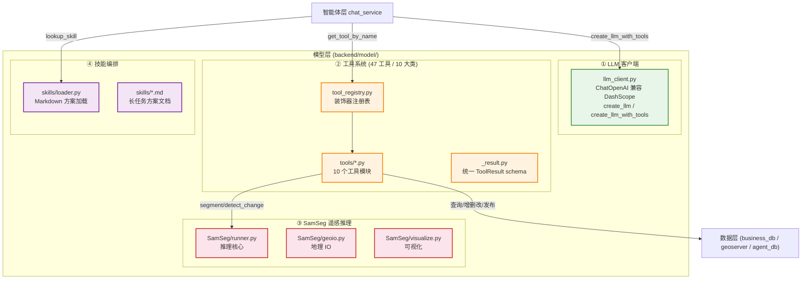
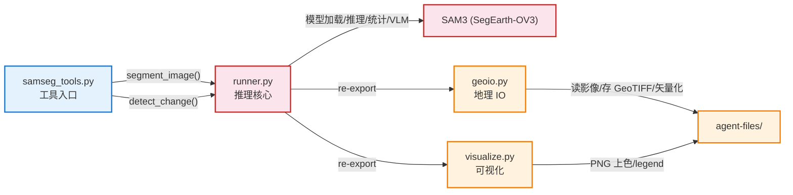

# 模型层实施文档（认知 + 专业技能融合）

> 本文是 [architecture.md](./architecture.md) 的**实施配套**，聚焦"通用地学大模型 + 专业技能模型"如何融合落地。
> 模型层是系统的智能中枢，向上为智能体层提供推理能力，向下通过工具操作数据层。

---

## 一、模型层全景

模型层由 **4 个核心部件** 构成，形成"认知 + 技能 + 工具编排"的融合体系：



| 部件 | 关键文件 | 职责 | 上行接口 |
|------|---------|------|---------|
| ① LLM 客户端 | `llm_client.py` | 构造 LLM 实例 + 工具绑定 | `create_llm()` / `create_llm_with_tools()` |
| ② 工具系统 | `tool_registry.py` + `tools/*.py` + `_result.py` | 47 工具 + 装饰器注册 + 统一 schema | `get_all_tools()` / `get_tool_by_name()` |
| ③ SamSeg 推理 | `SamSeg/runner.py` + `geoio.py` + `visualize.py` | SAM3 分割/变化检测/矢量化/VLM 判读 | `run_segment()` / `run_change_detection()` |
| ④ 技能编排 | `skills/loader.py` + `skills/*.md` | Markdown 长任务方案 + 关键词检索 | `retrieve_skills()` |

---

## 二、核心部件 1：LLM 客户端

**关键文件**：[`backend/model/llm_client.py`](../backend/model/llm_client.py)

### 2.1 实现方法

**① 单一 LLM 抽象（DashScope 兼容 OpenAI 协议）**

通过 LangChain 的 `ChatOpenAI` 连接阿里云百炼（DashScope），无需 SDK 差异处理：

```python
def create_llm(model=None, temperature=None) -> ChatOpenAI:
    return ChatOpenAI(
        api_key=settings.dashscope_api_key,
        base_url=settings.dashscope_base_url,  # https://dashscope.aliyuncs.com/compatible-mode/v1
        model=model or settings.dashscope_model,  # 默认 qwen3.7-plus
        temperature=temperature or settings.default_temperature,  # 0.7
        max_tokens=settings.max_tokens,  # 4096
        stream_usage=settings.enable_context_cache,  # ★ 显式缓存必须开 stream_usage
    )

def create_llm_with_tools(tools, model=None, temperature=None) -> ChatOpenAI:
    llm = create_llm(model, temperature)
    return llm.bind_tools(tools, tool_choice="auto")  # LLM 自行决定是否调工具
```

**② 模型分工策略（降本）**

通过 `config.py` 的多模型配置，按任务复杂度分配模型：

| 用途 | 配置项 | 默认模型 | 选择理由 |
|------|--------|---------|---------|
| 主对话/Agent 推理 | `dashscope_model` | `qwen3.7-plus` | 强能力 + 函数调用，1M 免费额度 |
| 视觉理解 | `vision_model` | `qwen3.7-plus` | 多模态，复用主模型 |
| 短期摘要 | `summary_model` | `deepseek-v4-flash` | 轻量快速，免费额度，不花主模型 token |
| 长期记忆提炼 | `long_term_memory_model` | `deepseek-v4-flash` | 同上，后台异步 |

> ★ 摘要/记忆提取用便宜模型是**核心降本策略**——主对话的 token 消耗留给真正的推理，辅助任务走免费额度模型。

**③ 关键坑点：stream_usage**

```python
stream_usage=settings.enable_context_cache
# ★ 显式缓存开启时必须为 True, 否则无法统计 cached_tokens 命中率
# 关闭缓存时 DashScope 隐式缓存仍自动生效 (命中按 20% 计费)
```

---

## 三、核心部件 2：工具系统（47 工具 / 10 大类）

**关键文件**：
- [`backend/model/tools/tool_registry.py`](../backend/model/tools/tool_registry.py) — 注册表
- [`backend/model/tools/*.py`](../backend/model/tools/) — 10 个工具模块
- [`backend/model/tools/_result.py`](../backend/model/tools/_result.py) — 统一 schema

### 3.1 注册机制（装饰器顺序是关键）

```python
@register_tool("layer_control")   # ← 外层: 把 @tool 包装后的 StructuredTool 注册到全局表
@tool                             # ← 内层: 先执行, 把函数包装为 LangChain StructuredTool
def toggle_layer_visibility(layer_name, action, workspace=""):
    ...
```

**为什么顺序重要**：Python 装饰器从下往上执行——先 `@tool` 把函数变成 `StructuredTool`，再 `@register_tool` 把它注册。注册时用 `func.name`（StructuredTool 属性）而非 `func.__name__`。

**注册表结构**：

```python
_tool_registry: Dict[str, Dict[str, Callable]] = {}   # category → {tool_name → tool}
_tool_category_map: Dict[str, str] = {}                # tool_name → category (反向映射)
```

**查询接口**：

```python
get_all_tools() -> Dict[str, Callable]        # 扁平 dict, 供 bind_tools
get_tools_for_llm() -> list                   # 供 bind_tools 的工具列表
get_tool_by_name(name) -> Optional[Callable]  # Agent 推理时按名查
get_tool_category_map() -> Dict[str, str]     # 供 system prompt 按分类分组
```

**自动注册**：`backend/model/tools/__init__.py` 通配导入 10 个工具模块，`main.py` 只需 `import backend.model.tools` 即触发全部注册。`samseg_tools` 用 `try/except` 包裹（torch 缺失时跳过），保证优雅降级。

### 3.2 工具分类与清单（10 大类）

| category | 中文标签 | 工具数 | 代表工具 |
|----------|---------|-------|---------|
| `samseg` | 遥感解译分析 | 4 | `segment_image` / `detect_change` / `understand_image` |
| `geoserver` | 图层服务操作 | 8 | `upload_raster_layer` / `download_shapefile_layer` / `delete_geoserver_layer` |
| `database` | 数据库查询 | 10 | `query_and_render_table` / `search_images_by_region` |
| `preprocess` | 数据预处理 | 3 | `build_pyramid` / `convert_to_cog` / `check_topology` |
| `report` | 报表生成 | 4 | `generate_monitor_report` / `export_change_vector` |
| `analysis` | 掩膜/矢量分析 | 3 | `analyze_connected_components` / `visualize_vector` |
| `layer_control` | 地图图层控制 | 5 | `toggle_layer_visibility` / `load_geoserver_layer` |
| `sandbox` | 沙盒代码与文件 | 5 | `run_python_code` / `run_shell_command` |
| `skill` | 长任务技能 | 2 | `lookup_skill` / `list_available_skills` |
| `memory` | 记忆管理 | 4 | `view_user_memory` / `clear_conversation_summary` |

> ★ memory 工具物理位于 `agent/tools/`（避免 model→agent 反向依赖），共 4 个，未计入 39 个主工具总数。

### 3.3 工具返回的统一 schema（v2.5）

**三种 type 取值**（全代码库只有 3 种）：

| type | 含义 | 出现工具 |
|---|---|---|
| `frontend_action` | 触发前端渲染/下载/图层控制 | 18 个工具 |
| `success` | 纯数据/文本结果 | 21 个工具 |
| `error` | 失败 | 所有工具的错误路径 |

**helper 函数**（`_result.py`，强制新工具使用）：

```python
build_success(summary, data=None)                    # → {"type":"success", ...}
build_error(msg)                                     # → {"type":"error", ...}
build_frontend_action(action, params, description,    # → {"type":"frontend_action", ...}
                      wait_for_result=False, summary="", data=None)
build_download_action(file_url, filename, summary)   # frontend_action 的 download 特化
build_render_image_action(params, ...)               # frontend_action 的 render_image 特化
```

**标准 frontend_action 结构**（helper 保证 `instruction.type == action`）：

```python
{
    "type": "frontend_action",
    "action": "render_image",              # == instruction.type (helper 保证一致)
    "instruction": {
        "type": "render_image",
        "action": "render_image",
        "params": {
            "image_url": "/api/v1/upload/{conv}/xxx.tif",     # 原图 (地图底图层)
            "mask_tif_url": "/api/v1/download/.../xxx.tif",   # 掩膜 GeoTIFF (半透明叠加层)
            "input_image_path": "/abs/path/x.tif",            # 宿主机路径
            "vector_url": "/api/v1/download/.../xxx.geojson", # 矢量 GeoJSON (地图矢量层)
            "legend": [{"name": "建筑", "hex": "#ff0000"}],
            "has_crs": True
        }
    },
    "wait_for_result": False,              # 图层控制类必须 True
    "description": "正在渲染分割结果",
    "summary": "...",                      # ← 喂给 LLM 的统计摘要
    "data": {"stats": {...}, "mask_tif_path": "/abs/x.tif"},
    "verification": {"ok": True, "size_bytes": 12345}   # 成功契约校验
}
```

### 3.4 工具如何调用数据层（对接点）

| 工具类别 | 数据层调用 | 典型函数 |
|---------|----------|---------|
| `database` | `business_db.*` | `query_and_render_table` → `read_table_data` |
| `geoserver` | `geoserver_client.*` | `upload_raster_layer` → `upload_raster` + `register_image_metadata` |
| `analysis` | `business_db.register_vector_layer` | `visualize_vector` 成功后登记 |
| `sandbox` | 文件系统 + Docker | `run_python_code` → 容器执行 |

> ★ **自动登记闭环**：上传类工具（`upload_raster_layer` / `upload_shapefile_layer`）成功后自动调 `register_image_metadata` / `register_vector_layer`，保证 GeoServer 发布的图层在业务库有元数据记录，支持后续时空检索。

### 3.5 新增工具的标准流程

1. 在 `backend/model/tools/` 选合适模块（或新建），写函数 + `@tool` 装饰器
2. 在函数上方加 `@register_tool("category")`（category 从 10 大类选）
3. 返回值用 `_result.py` 的 helper（`build_success` / `build_frontend_action`）
4. 如调重工具（samseg/report/preprocess/analysis），加入 `HEAVY_TOOL_CATEGORIES` 触发 `ai_task` 持久化
5. `import backend.model.tools` 自动触发注册，system prompt 的工具目录自动同步（`_build_tools_catalog()` 实时读注册表）

---

## 四、核心部件 3：SamSeg 遥感推理

**关键文件**：
- [`backend/model/SamSeg/runner.py`](../backend/model/SamSeg/runner.py) — 推理核心
- [`backend/model/SamSeg/geoio.py`](../backend/model/SamSeg/geoio.py) — 地理 IO
- [`backend/model/SamSeg/visualize.py`](../backend/model/SamSeg/visualize.py) — 可视化
- [`backend/model/tools/samseg_tools.py`](../backend/model/tools/samseg_tools.py) — 工具封装

> 详细架构见 [architecture-samseg.md](./architecture-samseg.md)。本文聚焦实施方法。

### 4.1 三层职责拆分



| 层 | 文件 | 职责 |
|---|---|---|
| **工具入口** | `samseg_tools.py` | 接收 LLM 调用参数，编排 runner + geoio + visualize，构造 `frontend_action` |
| **推理核心** | `runner.py` | 模型加载（全局缓存）、`run_segment` / `run_change_detection`、VLM 判读 |
| **地理 IO** | `geoio.py` | 读源影像、存 GeoTIFF 掩膜、矢量化为 GeoJSON |
| **可视化** | `visualize.py` | PNG 上色、颜色图注 legend |

### 4.2 实现方法

**① 导入修复（零侵入接入子项目）**

SamSeg 子项目原用裸导入（`from infer import ...`），在 `backend.model.SamSeg` 包结构下会 ImportError。runner.py 用 `sys.path.insert` 方案零侵入接入：

```python
_SAMSEG_PROJECT_DIR = Path(__file__).resolve().parent / "SamSeg"

def _ensure_imports():
    samseg_dir = str(_SAMSEG_PROJECT_DIR)
    if samseg_dir not in sys.path:
        sys.path.insert(0, samseg_dir)
    import infer  # 此时 infer.py 顶层的 from sam3 import ... 才能找到 sam3/ 目录
    return infer
```

**② 模型全局缓存（3.3GB 权重只加载一次）**

```python
_processor = None   # 全局单例
_device = None

def samseg_available() -> bool:
    """惰性检测: torch + 权重 + BPE + infer 模块 import 全部成功"""
    # 实际尝试 import infer 捕获 pycocotools/scikit-image 等深层依赖缺失
```

**③ 推理核心接口**

```python
def run_segment(image_path, output_path, classes=None) -> Optional[dict]
    # 单图语义分割, 返回 {mask_png, mask_tif, geojson, stats, legend}

def run_change_detection(t1_path, t2_path, output_path, classes=None) -> Optional[dict]
    # 双时相变化检测, 返回 {change_png, change_tif, geojson, stats} + VLM 业务归类
```

**④ 类别映射（中英文）**

支持中文类别名（建筑/道路/水...）→ SamSeg 英文同义词 query；未指定或映射失败时回退到 SamSeg 默认 7 类。

**⑤ 优雅降级**

torch/权重/infer 缺失时 `samseg_available()` 返回 False，`samseg_tools.py` 的 4 个工具直接返回 `type=error`，不影响其他工具。

### 4.3 产物落盘（对接文件存储）

```python
# samseg_tools.py — 产物路径派生
_get_output_root()  → samseg/generate/{proj}/{conv}/
_get_vector_root()  → samseg/vector/{proj}/{conv}/
_get_upload_root()  → samseg/send/{conv}/

# 产物命名: {conv8}_{语义}_{rand4}.{ext}
```

**产物矩阵**（一次 `segment_image` 调用）：
- `{conv8}_segmask_{rand}.png` — 上色掩膜（可视化）
- `{conv8}_segmask_{rand}.tif` — GeoTIFF 掩膜（地图叠加层，保留地理坐标）
- `{conv8}_vector_{rand}.geojson` — 矢量化结果（地图矢量层）
- 统计 `stats`（每类像素数/面积/占比）+ `legend`（颜色图注）

---

## 五、核心部件 4：技能编排（长任务）

**关键文件**：
- [`backend/model/skills/loader.py`](../backend/model/skills/loader.py) — 加载与检索
- [`backend/model/skills/*.md`](../backend/model/skills/) — 技能方案文档

### 5.1 实现方法

**① 文件扫描 + 懒加载缓存**

```python
_skills_cache: Optional[List[Dict[str, Any]]] = None  # 模块级缓存

def _load_all() -> List[Dict]:
    """扫描 skills/*.md (排除 README), 解析为 [{name, title, keywords, content}]"""
    # 首次访问时加载, 内容稳定后缓存

def _parse_markdown(file_path) -> Dict:
    """提取: title (首个#标题) + name (文件名) + keywords (触发场景段) + content (全文)"""
```

**② 关键词检索算法（无需向量库）**

```python
def retrieve_skills(query, top_k=3) -> List[Dict]:
    # 1. 分词: 英文词(≥2字符) + 中文 2-4 字滑窗
    # 2. 打分: query token 与 skill keywords 的重叠计数
    # 3. 过滤: score < 3 的结果剔除 (避免单操作误匹配)
    # 4. 排序: score 降序取 top_k, 每个结果含完整 content
```

### 5.2 技能文档约定

每个 `skills/*.md` 遵循约定（无需改代码即可新增）：

```markdown
# 标题
## 触发场景          ← 描述何时适用, 引用词成为 keywords
（含 "用户可能的说法"）
## 标准步骤          ← 具体工具调用名 + 前置条件 + 异常处理
1. upload_raster_layer(<file_path>)
2. insert_data("<表名>", {...})
3. load_geoserver_layer(...)
## 完成判断 / 关键原则
```

> ★ **关键设计**：技能方案**不注入 system prompt**（太长）。LLM 识别长任务意图后**主动调** `lookup_skill` 取步骤。

### 5.3 新增技能

往 `backend/model/skills/` 加一个遵循约定的 `.md` 文件，`loader.py` 启动时自动扫描加载，`lookup_skill` 即可检索到，**无需改代码**。

> 撰写技能方案时用**通用占位**（`<表名>` / `<图层名>`），不要写死具体业务名称，保证方案与数据源解耦、可复用。

---

## 六、模型层与上下层的对接

### 6.1 向上对接智能体层

```python
# chat_service.py 使用模型层的入口
from backend.model.llm_client import create_llm_with_tools
from backend.model.tools.tool_registry import get_tool_by_name, get_tools_for_llm

# 1. 构造带工具的 LLM
llm = create_llm_with_tools(get_tools_for_llm())

# 2. 推理循环中按名执行工具
tool = get_tool_by_name(tool_call["name"])
result = tool.invoke(tool_call["args"])
```

### 6.2 向下对接数据层

```python
# samseg_tools.py → business_db (自动登记元数据)
from backend.data import business_db
business_db.register_image_metadata(layer_name=..., bbox=..., ...)

# data_tools.py → geoserver_client + business_db
from backend.data import geoserver_client, business_db
result = geoserver_client.upload_raster(file_path, ...)
if result["status"] == "success":
    business_db.register_image_metadata(...)  # ★ 自动登记闭环
```

---

## 七、关键设计原则总结

1. **单一 LLM 抽象**：`ChatOpenAI` 兼容 DashScope，无需 SDK 差异；模型分工降本（主对话用强模型，摘要/记忆用便宜模型）。
2. **装饰器注册机制**：`@register_tool` + `@tool` 双装饰器，工具数可无限扩展，system prompt 自动同步。
3. **统一 ToolResult schema**：3 种 type（frontend_action / success / error）+ helper 函数，保证 `instruction.type == action`。
4. **三层职责拆分**（SamSeg）：推理核心 / 地理 IO / 可视化分离，runner re-export 保持契约不破。
5. **优雅降级**：SamSeg（torch 缺失）/ sandbox（Docker 缺失）/ DB 缺失，各自独立降级，不影响其他工具。
6. **自动登记闭环**：上传类工具成功后自动写元数据，GeoServer 发布 ↔ 业务库元数据保持同步。
7. **技能文档即配置**：Markdown 方案无需改代码，文件扫描 + 关键词检索，启动自动加载。

> 智能体层如何调度这些模型能力（ReAct 推理 + 记忆编排）详见 [impl-agent.md](./impl-agent.md)。
