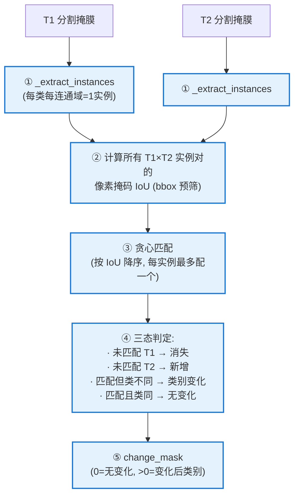

# SamSeg 遥感分析（分割 / 变化检测 / 矢量化 / VLM 判读）

> 本文是 [architecture.md](../architecture.md) 的子文档。系统总览见总纲。

---

## 10. SamSeg 遥感分析

> **一句话**：SegEarth-OV3（基于 SAM 3 的训练免开放词汇遥感分割/变化检测）封装为 4 个工具（分割/变化检测/视觉理解/渔网切片），用户上传图片后 Agent 自动推理，结果含彩色分割 PNG + 矢量 GeoJSON 图斑 + 类别图注 + 连通域统计 + **业务变化类型 VLM 判读**。

**关键文件**（SamSeg 包按职责拆为三层，阶段 23 重构）：
- [`backend/model/SamSeg/runner.py`](../../backend/model/SamSeg/runner.py) — **推理核心层**：模型缓存 + 分割/变化检测 + 连通域统计 + VLM 业务判读（~770 行，纯算法，不含可视化/落盘）
- [`backend/model/SamSeg/visualize.py`](../../backend/model/SamSeg/visualize.py) — **可视化层**：`save_color_mask_png`（PNG 上色落盘）+ `build_legend`（颜色图注）。轻量依赖（仅 PIL/numpy）
- [`backend/model/SamSeg/geoio.py`](../../backend/model/SamSeg/geoio.py) — **GeoIO 层**：`save_geotiff_mask`（带 CRS 掩膜）+ `vectorize_mask_to_geojson`（矢量 GeoJSON + Shapefile）+ `export_shp_from_gdf`。依赖 rasterio/geopandas
- [`backend/model/SamSeg/edge_utils.py`](../../backend/model/SamSeg/edge_utils.py) — 边缘算子（distance/canny/sobel），供 `overlay_edge_on_image` 手动工具用
- [`backend/model/tools/samseg_tools.py`](../../backend/model/tools/samseg_tools.py) — `segment_image` / `detect_change` / `understand_image` / `prepare_cd_dataset_by_fishnet` 工具（通过 `runner.xxx()` 调用，re-export 保证契约不破）
- [`backend/main.py`](../../backend/main.py) — `/api/v1/samseg/upload`（上传）、`/api/v1/upload/{filepath}`（原图）、`/api/v1/download/{filepath}`（结果）、`/api/v1/vector/shp-to-geojson`（Shapefile→GeoJSON）

> ★ **职责拆分原则**：推理核心（runner）只关心模型与算法；可视化（visualize）只关心"渲染外观"（PNG/图注）；GeoIO（geoio）只关心"地理坐标 + 产物落盘"。三层解耦，无循环依赖（geoio/visualize 不反向依赖 runner）。

### 10.1 工作机制

```mermaid
flowchart LR
    UPLOAD["🖼️ 前端点上传按钮<br/>选图 (1或2张)"] -->|"POST /api/v1/samseg/upload"| SAVE["后端存 agent-files/samseg/send/{conv}/<br/>返回绝对路径"]
    SAVE -->|"立即显示原图"| SHOW["前端 showImageInPanel<br/>(不等分割)"]
    SAVE -->|"WS: chat_request"| AGENT["Agent ReAct 循环"]
    AGENT -->|"调 segment_image/detect_change"| TOOL["samseg_tools"]
    TOOL --> RUNNER["runner.run_segment /<br/>run_change_detection"]
    RUNNER --> PROC["_get_processor()<br/>SAM3 模型全局缓存"]
    PROC --> INFER["multipass_inference<br/>→ postprocess"]
    INFER --> PALETTE["visualize.save_color_mask_png<br/>上色存 PNG (agent-files/samseg/generate/)"]
    PALETTE --> MASK["geoio.save_geotiff_mask<br/>掩膜 GeoTIFF (带 CRS)"]
    PALETTE --> VEC["geoio.vectorize_mask_to_geojson<br/>矢量 GeoJSON + Shapefile"]
    PALETTE --> STATS["runner._analyze_change_stats<br/>连通域统计 (scipy.ndimage)"]
    PALETTE --> LEGEND["visualize.build_legend<br/>颜色图注 (与 PNG 一致)"]
    STATS --> RET["返回 frontend_action(render_image)<br/>+ summary + data.stats"]
    MASK --> RET
    VEC --> RET
    LEGEND --> RET
    RET -->|"WS 推送"| FE["前端 renderImage<br/>原图层 + 掩膜叠加层 + 矢量层 + 图例"]
    RET -->|"ToolMessage"| LLM["LLM 据 stats 做定量描述"]

    classDef front fill:#e3f2fd,stroke:#1976d2,stroke-width:2px
    classDef back fill:#fff3e0,stroke:#f57c00,stroke-width:2px
    classDef ai fill:#e8f5e9,stroke:#388e3c,stroke-width:2px
    class UPLOAD,SHOW,FE front
    class SAVE,TOOL,RUNNER,PROC,INFER,PALETTE,STATS,LEGEND,RET back
    class AGENT,LLM ai
```



### 10.2 runner.py 核心接口

```python
# 推理封装层 (model.SamSeg.runner)
samseg_available() -> bool
# 检测 torch + 权重 + 深层依赖 (pycocotools/scipy/skimage), 惰性检测一次缓存

run_segment(image_path, output_path, classes=None,
            prob=0.6, max_passes=10, coverage_target=0.95) -> dict | None
# 语义分割: multipass_inference → postprocess → 上色存 PNG → 连通域统计 → 图注
# 返回 {output_path, stats, legend, summary}
# ★ prob=0.6 (P1-2): 首轮置信度阈值, 比衰减后的 0.343 严, 两期更一致

run_change_detection(t1_path, t2_path, output_path, classes=None,
                     prob=0.6, max_passes=10, coverage_target=0.95,
                     min_area=200, iou_threshold=0.3) -> dict | None
# 变化检测: 双时相分别分割 → 实例级 IoU 对比 → 上色 PNG + 统计 + 图注
# ★ min_area=200 / iou_threshold=0.3 (P0): 收紧匹配, 减少误判碎片
```

**关键设计**：
- **模型缓存**：全局 `_processor` 单例，3.3GB 权重只加载一次（首次几十秒，后续复用）
- **类别映射**：中文（建筑/道路/水...）→ 英文标准名（building/road/water...），未指定时回退默认 7 类
- **导入修复**：`sys.path.insert` 零侵入接入 SamSeg 子项目，不改其 40+ 处 import
- **图注颜色 = build_palette 算出的色**：不在前端另写映射表，避免颜色与 PNG 不一致
- **★ 误判优化（P0+P1，见 10.6）**：`prob` 生效（原为死代码）+ iou/min_area 收紧

### 10.3 默认类别与图注

默认 7 类：`background` / `building` / `road` / `water` / `bareland` / `vegetation` / `farmland`

图注格式（颜色方块 + 中文类别名，自动换行）：
```
■ 建筑  ■ 道路  ■ 水  ■ 裸地  ■ 植被  ■ 农田
```

### 10.4 优雅降级

| 环境 | `samseg_available()` | 行为 |
|------|---------------------|------|
| sam3 conda（torch + CUDA + 权重） | True | 工具正常推理 |
| base（无 torch） | False | 工具返回 `{type:"error", msg:"SamSeg 不可用..."}`，**不影响其他 23 个工具** |

`backend/model/tools/__init__.py` 用 try/except 包裹 `samseg_tools` 导入，torch 缺失时跳过注册，不阻塞其他工具加载。

### 10.5 前端展示（render_image → 地图图层）

| 展示内容 | 来源 | 渲染为 |
|---------|------|--------|
| 输入原图 | `/api/v1/upload/{filepath}` | **OL ImageStatic 底图层**（透明度 1.0） |
| 掩膜 GeoTIFF | `params.mask_tif_url` | **OL ImageStatic 半透明叠加层**（透明度 0.5，替代旧 overlay） |
| 矢量图斑 GeoJSON | `params.vector_url` | **OL Vector 图层**（填充 25% + 蓝色描边） |
| 类别色块图注 | `params.legend` | 地图右上角 `.seg-legend-overlay` DOM 浮层 |

- 前端 `renderImage()`：原图层（底图）→ 掩膜叠加层 → 矢量层 → 图例浮层，按地理 extent 配准叠加（非旧的 flex 上下堆叠）
- 据图层 `input_image_path` 查 `/api/v1/image/meta` 拿 bbox+CRS，无 CRS 影像用虚拟坐标铺画布
- 切换对话时 `_clearMapLayers()` 清空业务图层后逐层重建（`_restoreWmsPanelFromConv`）

### 10.6 变化检测算法：实例级 IoU 匹配

变化区域提取**不是逐像素异或**（对配准误差极敏感，会报大面积假变化），而是 **实例级 IoU 匹配**。核心函数 `infer.py::compute_instance_change_map`，分五步：



**为什么实例级而非像素级**：以"对象"为单位配对，配准误差和分割边缘抖动不会让整片边缘都报变化。

| 步骤 | 关键设计 |
|------|---------|
| ① 提取实例 | `scipy.ndimage.label` 八连通标记，每类每个连通域=1 实例；`min_area` 过滤碎片 |
| ② IoU 计算 | **bbox 预筛**（不相交直接跳过省算）+ **像素掩码 IoU**（非 bbox IoU，反映真实空间重叠） |
| ③ 贪心匹配 | 按 IoU 降序逐一配对，每实例最多配一个（简单但够用） |
| ④ 三态判定 | 消失/新增/类别变化三类，`change_mask` 像素值=**变化后类别**，未变化=0 |
| ⑤ 后处理 | `postprocess` 形态学清理 + `min_area` 过滤变化碎片 |

### 10.7 误判优化（P0 + P1，2026-06）

变化检测曾出现误判碎片过多。诊断后发现根因**不在"用没用实例级"**（已是实例级），而在匹配阈值过宽松 + 两期分割各自不稳定。两层优化：

**P0：收紧匹配阈值**（治标，`runner.run_change_detection` 默认值）

| 参数 | 原值 | 新值 | 理由 |
|------|------|------|------|
| `iou_threshold` | 0.0 | **0.3** | 至少 30% 重叠才算同一对象，砍擦边误配（最大噪声源） |
| `min_area`（变化掩膜） | 64 | **200** | 变化碎片比分割碎片更该清掉 |

**P1：两期分割一致性**（治本）

- **P1-1 修复死代码**：`infer.py::multipass_inference` 的 `prob` 参数原被忽略（阈值硬编码 `0.7`），现改为读 `prob`，默认 `0.1→0.7`（=原硬编码，向后兼容）
- **P1-2 统一保守阈值**：`runner` 的 `prob 0.1→0.6`，首轮阈值远严于衰减后的 0.343 → 两期对稳定地物划到同一类 → 假"类别变化"大幅减少
- **不降 `max_passes`**（保持 10）：避免覆盖率不足→class-0 像素→假变化陷阱

| 参数 | 位置 | 优化前 | 优化后 |
|------|------|--------|--------|
| `iou_threshold` | runner | 0.0 | **0.3** |
| `min_area`（变化掩膜） | runner | 64 | **200** |
| `prob`（infer 默认） | infer | 0.1（死代码） | **0.7**（生效） |
| `prob`（runner 默认） | runner | 0.1 | **0.6** |
| `max_passes` | runner | 10 | 10（不变） |

> 完整诊断与改动细节见 [PROGRESS.md 阶段 7](../PROGRESS.md)。下一步若仍不够：P1 方案 B（prompt-based CD，T2 用 T1 实例作 SAM3 prompt，两期一致性由模型保证）。

> 详细实现过程（阶段 2-7 的改动）见 [PROGRESS.md](../PROGRESS.md)。

### 10.8 栅格→矢量（阶段 12，#6 图斑提取）

`detect_change` / `segment_image` 除输出彩色 PNG，**同步产出 GeoJSON 矢量图斑**（解锁规则套合/图斑查询/矢量导出）。

- 矢量化入口：`runner._vectorize_mask_to_geojson` 调 `backend/data/vector/vectorize.py::polygonize_mask`
- 坐标系：从源 GeoTIFF 读 `transform`/`crs`（非地理影像则像素坐标系）
- 真实面积：地理坐标系自动转 UTM 算 m²，投影坐标系直接用
- 输出：`agent-files/samseg/vector/{proj}/{conv}/*.geojson`，含 `class_id/class_name/area_m2/perimeter_m/geometry`（v2.4 目录顺序：项目/会话）

### 10.8.1 矢量结果可视化（阶段 19 → 阶段 21 变更）

> ★ **阶段 21 变更**：原阶段 19 因"工作区卡片墙仅支持 ``、无法渲染矢量"而引入 `visualize_vector` 工具把 GeoJSON **栅格化为 PNG** 再进工作区。**阶段 21 引入 OpenLayers 地图容器后，矢量可直接渲染**（`showVectorFile()` → OL Vector 图层），栅格化 PNG 不再是唯一路径——但 `visualize_vector` 工具保留，用于需要带底图叠加的可视化 PNG（如报告插图）或导出 Shapefile。

**工具** `visualize_vector`（`backend/model/tools/vector_tools.py`，analysis 类）：

| 维度 | 说明 |
|---|---|
| 入参 | `(geojson_path, background_image_path="", alpha=0.5, export_shp=True)` |
| 核心函数 | `rasterize_vector_to_png()`（纯函数，工具与 samseg 自动追加共用，单一来源） |
| 渲染 | matplotlib Agg + CJK 字体；按 `class_name` 稳定哈希配色 + 右侧图例；有底图时按 rasterio bounds 对齐叠加（无 CRS 时按像素范围叠加） |
| 产物 1 | PNG（阶段21前 → 卡片墙；阶段21后 → 仍可用于报告，矢量本身走地图 `showVectorFile`） |
| 产物 2 | Shapefile（可选，`export_shp=True`；Fiona 0KB 拦截，ASCII stem） |
| 成功契约 | `verification.ok=True` + `data.artifact_path` 真实存在 + `data.feature_count>0`；`export_shp=True` 时 `data.shp_path` 指向真实 .shp |
| 降级 | geopandas/matplotlib 缺失或 GeoJSON 为空 → `build_error`，不阻断主流程 |

**新增：Shapefile → GeoJSON 反向端点（阶段 21）**：`GET /api/v1/vector/shp-to-geojson?shp_path=...`，geopandas 读 shp 目录（自动找 .dbf/.shx/.prj）→ 返回 GeoJSON 供前端 `showVectorFile` 渲染。非 4326 自动转投影，feature >5000 采样保护。

**自动联动**（`samseg_tools`）：
- `segment_image` / `detect_change` 产出的 `vector_url`（GeoJSON）通过 `params.vector_url` 传给前端，`renderImage()` 自动调 `showVectorFile()` 叠加为地图矢量图层（阶段 21 新增，无需栅格化）。
- 失败只记 warning，不阻断分割/变化检测主结果。
- ★ **地图容器最终图层顺序**（阶段 21，取代旧的"卡片堆叠"）：`segment_image` → **原图层（底图）+ 掩膜 GeoTIFF 半透明叠加层 + 矢量图斑图层 + 图例浮层**；`detect_change` → T1 原图层 + 变化掩膜叠加层 + 矢量变化图斑图层。
- 注：阶段 19 的"叠加图/边缘叠加"已随阶段 21 移除（掩膜叠加层用图层透明度实现等效效果）。

### 10.9 业务变化类型 VLM 判读（阶段 12，#7 语义判读）

`detect_change` 在产出 PNG+GeoJSON 后，**自动调视觉多模态模型判读业务变化类型**：

| 实现层 | 函数 | 策略 |
|---|---|---|
| 主入口 | `runner.classify_change_type(...)` | VLM 优先，规则兜底 |
| VLM 判读 | `runner.classify_change_type_by_vlm(...)` | 把 T1/T2+变化结果图喂 `vision_model`(qwen3.7-plus)，输出 JSON `{change_type, confidence, reason}` |
| 规则兜底 | `runner.classify_change_type_by_rule(...)` | 基于 `stats.per_class` 类别分布映射（building 主导=新增建筑 / farmland+vegetation=耕地转林地 / bareland 主导=推土 / water=水体变化） |

**业务类型候选**：新增建筑 / 建筑消失 / 耕地转林地 / 推土 / 水体变化 / 植被变化 / 道路变化 / 其他

**降级**：VLM 不可用（无 DashScope key / 限流）→ 自动走规则映射，detect_change 仍正常返回，只是 `change_type.source='rule'`。

输出注入：`detect_change` 返回的 `data.change_type = {change_type, confidence, reason, source}`，summary 文本也含"业务变化类型: XX (置信度 0.85)"。

---
