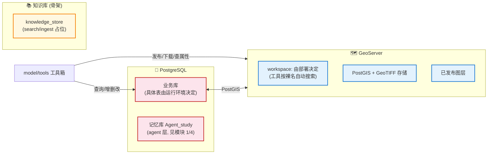
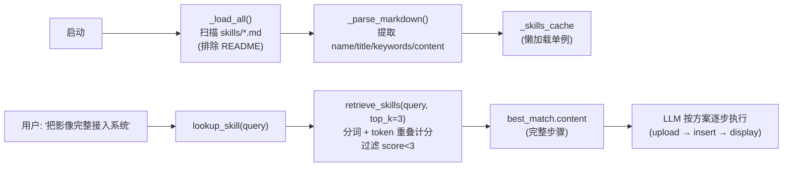

# 平台层架构（前端指令执行 / GeoServer 数据集成 / 技能编排 / 视觉设计）

> 本文是 [architecture.md](../architecture.md) 的子文档。系统总览见总纲。

---

## 7. 前端指令执行层

> **一句话**：前端收到 `frontend_action` 后，按 `event_type` 路由到对应渲染函数（图表/表格/图层/下载），执行完回传 `tool_result` 解除后端阻塞。

**按四个功能区拆分**（见 [frontend/](../../frontend/) 目录）：

| 功能区 | 目录 | 关键文件 | 职责 |
|---|---|---|---|
| **基础设施** | `core/` | `state.js` / `ws-chat.js` / `ws-send.js` / `init.js` | WebSocket 传输层 + 全局状态 + 启动编排 |
| **项目管理** | `project/` | `sidebar.js` / `workspace.js` | 侧栏会话/项目树 + 工作区文件浏览器 |
| **地图/影像** | `map/` | `wms-render.js` / `task-monitor.js` | OpenLayers 地图容器（WMS/影像/矢量图层叠加 + 地理缩放 + GetFeatureInfo）+ 任务日志面板 |
| **AI 聊天** | `chat/` | `msg-ui.js` / `thinking.js` / `conv-core.js` / `samseg.js` | 消息气泡 + Modal + Thinking 流转 + 对话切换 + SamSeg 上传 |

> 完整三层架构（`core/ws-chat.js` 分发 / `chat/conv-core.js` 回调注入 / `chat/thinking.js::executeFrontendAction` 执行）详见本文档 §7.2 执行闭环 + [communication.md](./communication.md)。

### 7.1 `event_type` 清单

> ★ **阶段 14 曾移除 Leaflet 地图模式**（前端改为卡片墙）；**阶段 21 又重新引入地图引擎**（OpenLayers 9），前端统一为 **OpenLayers 地图容器**（图层叠加 + 地理缩放）。

| event_type | 含义 | 执行函数 | 返回 Promise? |
|------------|------|---------|--------------|
| `render_image` | SamSeg 遥感结果图/沙盒图 | `renderImage()` → `showImageInPanel()`（加图层） | **是** |
| `layer_control` / `layer_group_control` | 图层显隐/切换 | `renderLayerControl()` → `showWmsInPanel()` | **是**（等 WMS 加载） |
| `layer_display` / `layer_locate` | 图层加载/定位 | `renderLayerDisplay()` → `showWmsInPanel()` | **是**（等 WMS 加载） |
| `download` | 下载文件（触发浏览器下载） | `renderDownload()` | 否 |

> 注：矢量文件（GeoJSON/Shapefile）不单独占用 event_type，由 `render_image` 的 `vector_url`/`mask_tif_url` 字段触发前端 `showVectorFile()` 叠加为地图矢量图层（详见 §7.3）。

> 注：`wms-render.js` 里仍保留 `renderChart`/`renderTable`/`renderPanel` 函数定义，但当前 `thinking.js` 的 event_type 路由未引用（后端不再发这些事件）。表格类工具结果走 `render_table` → `buildRichTable()` 的路径由消息渲染层（`msg-ui.js`）处理，不经过 `executeFrontendAction`。

### 7.2 执行闭环

```javascript
function executeFrontendAction(eventType, eventData, description, requestId) {
  // 1. 创建 render-block，显示「⏳ 执行中」
  // 2. 按 eventType 路由到对应 render 函数
  // 3. 渲染函数返回 resultPayload（或 Promise）
  // 4. ★★★ 关键: 回传结果，解除后端 await
  wsClient.sendToolResult({
    request_id: requestId, status: 'success', data: resultPayload,
  });
}
```

> 图层类工具返回 Promise（`showWmsInPanel` 等 `` onload/onerror），前端会等真实加载结果（含 10s 超时）再回传，保证后端 LLM 拿到准确的「图层是否成功显示」反馈。

### 7.3 OpenLayers 地图容器渲染引擎（阶段 21，地图容器模式）

> ★ **阶段 21 变更**：撤销阶段 14"移除地图引擎、统一为卡片墙"的决定，重新引入地图引擎 **OpenLayers 9.2.4**（CDN 引入，非 Leaflet）。理由：(1) 地理影像精确叠加需要图层级 bbox + CRS 配准，卡片墙的 flex 堆叠 + CSS transform 缩放无法实现原图与掩膜的地理叠加；(2) 原来靠后端预生成"overlay 混色图"实现叠加，代价是额外产物 + 信息损失，地图容器改用**图层透明度叠加**（原图层底图 + 掩膜半透明叠加层）即可达到同样效果，后端不再生成 overlay/edge 自动产物。

**关键文件**：[`frontend/map/wms-render.js`](../../frontend/map/wms-render.js)

**核心架构**：单例 `ol.Map` 挂载到 `#wmsViewport.ol-map-host`，每张影像/结果/WMS 图层/矢量都是一个 **OL 图层**（而非卡片），通过 `tag='business'` 标记业务图层以便 `_clearMapLayers()` 切换对话时清理。

**核心函数**：

| 函数 | 职责 |
|---|---|
| `initWmsMap()` | 创建 `ol.Map` 单例（缩放控件 + 比例尺 + 归属），挂载到 `#wmsViewport`，由 `init.js` 启动时调用 |
| `showImageInPanel(url, caption, legend, record, imagePath, artifactPath, overlay)` | 影像/结果加为 OL 图层：查 `/api/v1/image/meta` 拿 bbox+CRS → `ImageStatic` 图层；`overlay=true` 时透明度 0.5 作掩膜叠加层 |
| `showWmsInPanel(layerName, workspace, bbox, wmsUrl, caption, record)` | GeoServer WMS → `ImageWMS` 图层 + view fit bbox + 绑定 GetFeatureInfo 点击 |
| `showVectorFile(urlOrPath, caption, record)` ★ | **矢量统一入口**：`.geojson` → OL Vector 图层；`.shp` → 先调后端 `/api/v1/vector/shp-to-geojson` 转换再渲染 |
| `renderImage(container, data)` | SamSeg 结果渲染入口：原图层（底图）+ 掩膜叠加层（`mask_tif_url`，透明度 0.5）+ 矢量层（`vector_url`）+ 图例浮层 |
| `_clearMapLayers()` | 清空所有业务图层（保留控件/Overlay），切换对话时调用 |
| `_handleWmsFeatureInfo(layer, coord)` | WMS 点击 GetFeatureInfo：点击坐标 → 反算像素 i/j → 调 `/api/v1/geoserver/feature-info` → OL Overlay 弹窗 |
| `_appendPreviewParam(url)` | URL 加 `?preview=1` 触发后端 TIFF→PNG 转码 |

**图层叠加规则**（替代旧的"卡片堆叠"）：
1. 原图作为**底图层**（透明度 1.0），据 `input_image_path` 查坐标定位 extent
2. 掩膜 GeoTIFF 作为**半透明叠加层**（透明度 0.5，`overlay=true`），替代旧 overlay 混色图
3. 矢量 GeoJSON 作为 **Vector 图层**（填充 25% 透明 + 蓝色描边）
4. 图例渲染为地图右上角 **DOM 浮层**（`.seg-legend-overlay`）

**坐标处理**（关键，曾踩坑）：
- `/api/v1/image/meta` 返回的 bbox 是**源 CRS 坐标**（可能是 4326 经纬度，也可能是 3857 投影米）
- 判定：bbox 值 > 180 → 投影坐标（按 EPSG:3857 处理）；否则 EPSG:4326
- `ImageStatic` 的 `imageExtent` 用源 CRS 坐标 + `projection` 源 CRS（OL 内部投影到 view）
- 无 CRS 影像用**虚拟坐标铺画布**（extent=[0,0,W,H]，4326 兜底），统一进地图容器不搞双模式
- `view.fit()` 的 extent 必须先 `transformExtent` 到 view projection（否则视图跑到无效坐标导致图层不加载）

**无 CRS 影像处理**：手机照片等无地理坐标的影像，赋予虚拟 extent `[0,0,width,height]` 作为图层加入地图（EPSG:4326 兜底），仍能正常显示和叠加。

**WMS 缩放/拖拽**：OL 原生（鼠标滚轮缩放 + 拖拽平移 + `ol.control.Zoom` 按钮），取代旧的 `initWmsZoom()`/`applyWmsTransform()`（CSS transform）。

### 7.4 任务日志监控面板（阶段 12，#19）

**关键文件**：[`frontend/map/task-monitor.js`](../../frontend/map/task-monitor.js) — Modal 弹窗

| 功能 | 对接端点 |
|---|---|
| 任务列表（状态/进度/耗时过滤） | `GET /api/v1/tasks?status=&conversation_id=` |
| 任务详情（input/output/error/时间戳） | `GET /api/v1/tasks/{id}` |
| 执行日志（info/warning/error，正序） | `GET /api/v1/tasks/{id}/logs` |

入口：AI 头部"📋 任务日志监控"按钮（`openTaskMonitor()`）。

---

## 8. GeoServer 与数据集成

> **一句话**：GeoServer REST/WMS/WFS 客户端 + 业务库通用 CRUD + 知识库骨架，构成数据层。

**关键文件**：
- [`backend/data/geoserver_client.py`](../../backend/data/geoserver_client.py) — GeoServer 客户端
- [`backend/data/business_db.py`](../../backend/data/business_db.py) — 业务库 CRUD
- [`backend/data/knowledge/knowledge_store.py`](../../backend/data/knowledge/knowledge_store.py) — 知识库骨架

### 8.1 数据层架构



### 8.2 GeoServer 客户端接口

```python
# geoserver_client.py
geoserver_available() -> bool
get_layer_bbox(layer_name) -> Optional[Dict]        # GetCapabilities → {minx,miny,maxx,maxy}
sample_raster(layer_name, workspace=None, width=200, height=200, bbox=None) -> (ndarray, metadata)
list_layers(workspace=None) -> list
list_all_layers() -> list                            # [{name, workspace, full_name}]
resolve_layer_name(name) -> Optional[str]            # 裸名 → 全工作空间搜索 → workspace:layername
list_workspaces() -> list
list_services() -> Dict                              # {workspaces:[...], services:{WMS,WFS,WCS,REST}}
download_raster(layer_name, workspace=None, output_path=None) -> Optional[str]   # WMS GetMap geotiff
upload_raster(file_path, layer_name=None, workspace=None) -> Dict                # REST PUT coveragestores
layer_exists(workspace, layer_name) -> bool
upload_shapefile(file_path, layer_name=None, workspace=None) -> Dict             # REST PUT datastores
download_shapefile(layer_name, workspace=None, output_path=None) -> Optional[str] # WFS GetFeature SHAPE-ZIP
get_feature_info(layer_name, bbox, width, height, i, j, workspace=None) -> Dict  # WMS GetFeatureInfo
```

- 认证：`HTTPBasicAuth(settings.geoserver_username, settings.geoserver_password)`
- 容错：多数函数容忍 `workspace:layername` 或裸名，自动 `resolve_layer_name`
- `sample_raster` 兜底 bbox：青海湖 `(99.5, 36.2, 100.8, 37.1)`

### 8.3 业务库 CRUD

**表无关**——`business_db.py` 是通用 CRUD，表名作为参数传入（不绑定任何具体业务表）：

```python
db_available() -> bool
list_tables(schema="public") -> List[Dict]           # information_schema 查询
read_table_data(table_name, limit=100, offset=0) -> Optional[DataFrame]
get_table_statistics(table_name) -> Optional[Dict]   # {columns, row_count, numeric_stats}
insert_data(table_name, data) -> Dict
update_data(table_name, data, condition=None, condition_params=None) -> Dict
delete_data(table_name, condition=None, condition_params=None) -> Dict
```

- 连接池：`ThreadedConnectionPool(minconn=1, maxconn=5)`
- 降级：`psycopg2` 缺失或连接失败 → 返回 `None`，上层工具转 `type=error`

### 8.4 元数据管理与时空检索（阶段 12 新增，#2/#4）

**业务专用表**（不再表无关）——`business_db.py` 新增两个元数据表 + 7 个 CRUD 函数，对接清单 #2 空间入库 / #4 元数据管理。

**表结构**（[`scripts/migrate_business_schema.sql`](../../scripts/migrate_business_schema.sql)，幂等建表）：

| 表 | 用途 | 关键字段 | 索引 |
|---|---|---|---|
| `image_metadata` | 影像元数据（时间/分辨率/覆盖范围） | `layer_name`(UNIQUE), `bbox_geom`(GEOMETRY POLYGON 4490), `bbox_jsonb`(JSONB 兜底), `acquired_at`, `resolution`, `width/height/band_count` | GIST 空间索引 + 时间索引 |
| `vector_layer` | 矢量图层元数据（规则/变化/行政区） | `layer_name`(UNIQUE), `kind`(rule/change/administrative), `bbox_geom`, `feature_count`, `total_area_m2` | GIST 空间索引 |

**关键函数**（[`business_db.py`](../../backend/data/business_db.py)）：

```python
ensure_business_schema() -> bool          # 幂等建表, PostGIS 缺失时降级 JSONB
postgis_available() -> bool               # 惰性检测, 缓存
register_image_metadata(layer_name, ..., bbox, srid) -> int  # UPSERT, 非 4490 自动 ST_Transform
register_vector_layer(layer_name, kind, ..., bbox) -> int   # UPSERT
query_images_by_time(start, end, limit) -> List             # 时间检索
query_images_by_region(bbox, limit) -> List                 # 空间检索 (ST_Intersects 或 Python 内存过滤)
list_image_metadata(limit) / list_vector_layers(kind, limit)
```

**自动登记**：
- `main.py::upload_samseg_images` 上传 GeoTIFF 后自动调 `_try_register_image_metadata`（仅地理影像生效，PNG/JPG 跳过）
- `data_tools.py::upload_raster_layer` / `upload_shapefile_layer` 成功后自动登记

**SRID 修复（阶段 13）**：`rasterio.crs.to_epsg()` 对 Web Mercator Auxiliary Sphere 返回 None，用 bounds 数值范围兜底（`>180` 必为投影坐标 → 3857），PostGIS `ST_Transform` 正确转换。

**降级**：PostGIS 不可用时 bbox 存 JSONB，空间查询走 Python 内存过滤。

### 8.5 知识库（骨架）

[`knowledge_store.py`](../../backend/data/knowledge/knowledge_store.py) 当前是**纯占位**：

```python
knowledge_available() -> bool          # 恒返回 False
search(query, top_k=5, filters=None) -> []   # 恒返回 []
ingest(chunks) -> 0                    # 恒返回 0
```

**规划后端**（README 记载，未实现）：pgvector（推荐）/ 结构化 PG 表（tsvector）/ 外部向量服务（Milvus/Qdrant）。配置项 `knowledge_*` 待选型后加入 `config.py`。

---

## 9. 技能编排（长任务）

> **一句话**：长任务（如数据入库流水线）通过 Markdown 方案文档承载，启动时文件扫描建立索引，LLM 识别意图后主动调 `lookup_skill` 取步骤逐步执行。

**关键文件**：
- [`backend/model/skills/loader.py`](../../backend/model/skills/loader.py) — 加载与检索
- [`backend/model/skills/*.md`](../../backend/model/skills/) — 技能方案文档
- [`backend/model/tools/skill_tools.py`](../../backend/model/tools/skill_tools.py) — 工具封装

### 9.1 工作机制



### 9.2 检索算法

`retrieve_skills(query, top_k=3)`：
1. **分词**：英文词（≥2 字符）+ 中文 2-4 字滑窗
2. **打分**：query token 与 skill keywords 的重叠计数
3. **过滤**：`score < 3` 的结果剔除（避免单操作误匹配）
4. **排序**：score 降序取 top_k，每个结果含完整 `content`

### 9.3 技能文档结构

每个 `skills/*.md` 遵循约定（无需改代码即可新增）：

```markdown
# 标题
## 触发场景          ← 描述何时适用，引用词成为 keywords
（含 "用户可能的说法"）
## 标准步骤          ← 具体工具调用名 + 前置条件 + 异常处理
1. upload_raster_layer(...)
2. insert_data("<表名>", {...})
3. load_geoserver_layer(...)
## 完成判断 / 关键原则
```

> 撰写技能方案时请用**通用占位**（`<表名>` / `<图层名>` 等）描述参数，不要写死具体业务名称、工作空间或业务表名，以保证方案与具体数据源解耦、可复用。

**关键设计**：技能方案**不注入 system prompt**（太长）。LLM 识别长任务意图后**主动调** `lookup_skill` 取步骤。

### 9.4 已注册方案

> 当前 `backend/model/skills/` 目录为空（暂无已注册的长任务方案）。新增方案只需往该目录加一个遵循 9.3 约定的 `.md` 文件，`loader.py` 启动时自动扫描加载，`lookup_skill` 即可检索到，无需改代码。

**判定规则（通用）**：若用户**同时**要「发布为 GeoServer 图层」**且**「登记元数据到库」→ 属于入库类长任务；单纯上传用 `upload_raster_layer`（栅格）或 `upload_shapefile_layer`（矢量）单步即可。

### 9.5 技能工具接口

```python
# skill_tools.py
lookup_skill(query) -> Dict           # 检索，返回 best_match.content + 候选元数据
list_available_skills() -> Dict       # 列出所有技能元数据 {name, title, keywords}
```

---

---

## 11. 视觉设计系统（配色令牌）

> 项目品牌：**国土智察 自然资源遥感智能监测系统**
> 配色基于 logo（`frontend/image.svg`）色带提取，四色体系：白 / 浅蓝 / 浅绿 / 深蓝。
> 所有颜色通过 CSS 变量（`:root`）集中管理，定义在 `frontend/styles.css`。

### 11.1 五色语义体系

按用户感知重要度划分五级，覆盖 UI 全部交互场景：

| 语义 | 变量 | 色值 | 用途 |
|------|------|------|------|
| **白色（基底）** | `--bg-base` / `--bg-elevated` | `#ffffff` | 页面/卡片背景，最高视觉权重 |
| **浅蓝/浅灰（次要）** | `--bg-panel` / `--bg-hover` / `--text-secondary` | `#f1f7fc` / `#e0eef8` / `#5a7488` | 面板层、悬停态、辅助文字 |
| **深蓝（强调）** | `--accent` / `--accent-hover` | `#2c6fbd` / `#205599` | 主操作按钮、链接、激活态、强调标题 |
| **浅绿（辅助/成功）** | `--accent-green` | `#3fae5a` | 成功提示、工具调用、第二重要操作 |
| **红（危险）** | `--accent-red` | `#cf4444` | 删除、停止、错误、危险操作 |

> 另有 `--accent-amber`（琥珀，思考/等待态）和 `--accent-purple`（紫，数值/特殊标记）作为补充。

### 11.2 CSS 变量总表

| 分类 | 变量 | 色值 | 语义 |
|------|------|------|------|
| **背景层** | `--bg-base` | `#ffffff` | 页面基底（白） |
| | `--bg-panel` | `#f1f7fc` | 面板/header 背景（极浅蓝） |
| | `--bg-elevated` | `#fff` | 卡片/提升层（白） |
| | `--bg-hover` | `#e0eef8` | 悬停态（浅蓝） |
| | `--bg-inset` | `#e9f2f9` | 内嵌区（浅蓝白） |
| **边框** | `--border` | `#cee0ee` | 默认边框（浅蓝灰） |
| | `--border-strong` | `#9dbcd5` | 强边框（蓝灰） |
| **强调色** | `--accent` | `#2c6fbd` | 主操作色（深蓝） |
| | `--accent-hover` | `#205599` | 主操作悬停（更深蓝） |
| | `--accent-soft` | `rgba(44,111,189,.08)` | 主色柔化背景 |
| **辅助色** | `--accent-green` | `#3fae5a` | 成功/确认（浅绿） |
| | `--accent-amber` | `#d68910` | 警告（琥珀） |
| | `--accent-red` | `#cf4444` | 危险/错误（红） |
| | `--accent-purple` | `#3949c0` | 特殊标记（紫） |
| **文字** | `--text-primary` | `#1e2d3a` | 主文字（深蓝黑） |
| | `--text-secondary` | `#5a7488` | 次要文字（蓝灰） |
| | `--text-muted` | `#94abbf` | 弱化文字（浅蓝灰） |

### 11.3 字号层级（Typography Scale）

6 级字号梯度，所有元素通过 `var(--fs-*)` 引用，禁止裸像素值：

| 变量 | 值 | 应用场景 |
|------|------|---------|
| `--fs-hero` | `16px` | 页面主标题（顶部 header） |
| `--fs-xl` | `14px` | 正文/输入框/用户消息气泡/模态标题 |
| `--fs-lg` | `13px` | AI 消息/Markdown 内容/表格单元格 |
| `--fs-md` | `12px` | 侧栏会话名/Tab/按钮/代码块/面板标题 |
| `--fs-sm` | `11px` | 快捷按钮/图注/分组名/时间戳/状态标记 |
| `--fs-xs` | `10px` | 计数徽标/事件日志/标签(tag)/最小辅助 |

> 配套圆角令牌：`--r-xs:2px` / `--r-sm:3px` / `--r-md:4px` / `--r-lg:6px`

### 11.4 色彩层次

```
header / 面板层  →  #f1f7fc（极浅蓝，var(--bg-panel)）
     ↓ border 分隔
卡片 / 提升层    →  #ffffff（白，var(--bg-elevated)）
     ↓
悬停 / 交互态    →  #e0eef8（浅蓝，var(--bg-hover)）
```

三个 header 区域（`.header` / `.sidebar-header` / `.ai-header`）统一使用 `var(--bg-panel)`，与中间工作区面板无色差分界。调色只需改 `:root` 变量，全局生效。

### 11.5 Logo

- 文件：`frontend/image.svg`（SVG 矢量，任意缩放不失真）
- 位置：顶部 header `<h1>` 内，图片在前文字在后（`display:flex; align-items:center; gap:10px`）
- 尺寸：`height:46px`，配合 header `padding:6px 18px` 几乎填满 header 高度

---

## 附：模块职责对照表

| 模块 | 核心组件 | 文件 | 核心职责 |
|------|---------|------|---------|
| **1 会话与项目** | 项目/会话/消息管理 | `agent_db.py` + `main.py` | 三级组织 CRUD + 状态机 + `conversation_id` 贯通 |
| **2 ReAct 引擎** | 推理服务 | `chat_service.py` | 流式 thinking + 工具调度循环 + 停止回滚 |
| **3 工具系统** | 注册表 + 工具箱 | `tool_registry.py` + `tools/*` | 47 工具 + 装饰器注册 + 10 大分类 |
| **4 三层记忆** | 记忆编排 + 数据库 | `memory_context.py` + `self_correction.py` + `agent_db.py` | 工作/短期/长期记忆编排与持久化 (自纠学习融入长期记忆) |
| **5 Prompt 与缓存** | System Prompt | `system_prompt.py` | 动态工具目录 + CoT + 显式缓存块 |
| **6 WS 通信** | 连接/任务管理 | `ws_manager.py` + `core/ws-chat.js` | `request_id` 配对 + 阻塞等待 + 多对话并行 |
| **7 前端执行** | 指令执行器 (四功能区) | `core/` + `project/` + `map/` + `chat/` | event_type 路由 → OL 图层渲染 → 回执回传 (地图容器模式) |
| **8 数据集成** | GeoServer + 业务库 | `geoserver_client.py` + `business_db.py` | WMS/REST/WFS + 通用 CRUD + 元数据管理 + 知识库骨架 |
| **9 技能编排** | 技能加载/检索 | `skills/loader.py` + `skill_tools.py` | 文件扫描 + 关键词检索 + 长任务方案 |
| **10 SamSeg 遥感** | 推理封装 + 工具 | `SamSeg/runner.py` + `samseg_tools.py` | SAM3 分割/变化检测 + 连通域统计 + 矢量化 + VLM 业务判读 |

> **★ 记忆数据库归属**：`agent_db` 归入 **agent 层**（记忆是智能体自身状态），与 data 层的业务库职责分离。data 层只承载外部业务/空间/知识数据。
> **★ SamSeg 归属**：`SamSeg/runner.py` 归入 **model 层**（推理能力是模型的一部分），工具在 `model/tools/samseg_tools.py`。
