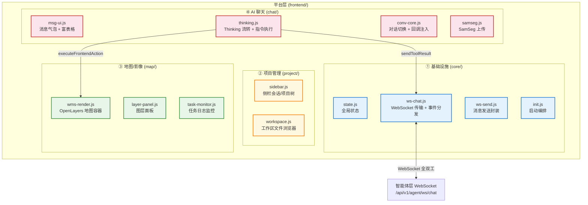
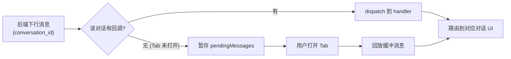
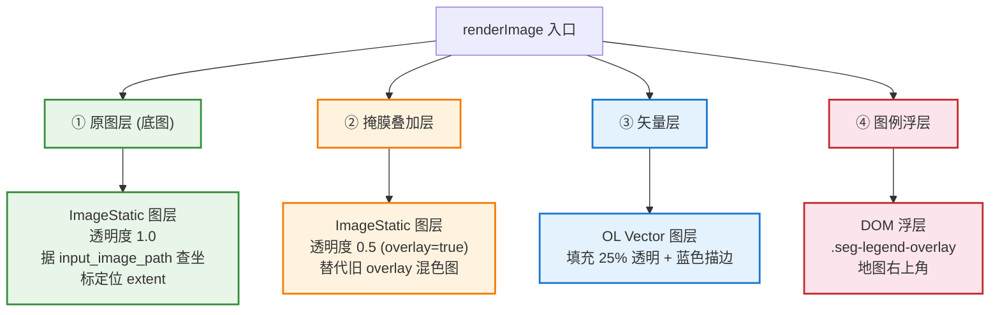

# 平台层实施文档（前端指令执行 + OpenLayers 地图容器）

> 本文是 [architecture.md](../architecture.md) 的**实施配套**，聚焦"前端如何执行后端指令、渲染结果、回传反馈"。
> 平台层面向终端用户，通过 WebSocket 全双工通道实现前后端协同，集成聊天交互 + OpenLayers 地图容器 + 数据面板 + 任务监控。

---

## 一、平台层全景

平台层由 **4 个功能区** 构成，按职责清晰拆分：



| 功能区 | 目录 | 关键文件 | 职责 |
|--------|------|---------|------|
| ① 基础设施 | `core/` | `state.js` / `ws-chat.js` / `ws-send.js` / `init.js` | WebSocket 传输层 + 全局状态 + 启动编排 |
| ② 项目管理 | `project/` | `sidebar.js` / `workspace.js` | 侧栏会话/项目树 + 工作区文件浏览器 |
| ③ 地图/影像 | `map/` | `wms-render.js` / `layer-panel.js` / `task-monitor.js` | OpenLayers 地图容器 + 图层面板 + 任务日志 |
| ④ AI 聊天 | `chat/` | `msg-ui.js` / `thinking.js` / `conv-core.js` / `samseg.js` | 消息气泡 + Modal + Thinking + 对话切换 + 上传 |

---

## 二、核心部件 1：WebSocket 传输层

**关键文件**：
- [`frontend/core/ws-chat.js`](../../frontend/core/ws-chat.js) — WebSocket 客户端 + 事件分发 + 多对话路由
- [`frontend/core/ws-send.js`](../../frontend/core/ws-send.js) — 消息发送封装
- [`frontend/core/state.js`](../../frontend/core/state.js) — 全局状态（`cs()` 快捷访问）

### 2.1 实现方法：连接与事件分发

```javascript
// ws-chat.js 核心结构
const wsClient = {
    ws: null,                    // WebSocket 实例
    pendingMessages: {},         // 未注册回调的对话消息缓冲 (按 conversation_id)

    connect() {
        this.ws = new WebSocket(`ws://${host}/api/v1/agent/ws/chat`);
        this.ws.onmessage = (event) => {
            const msg = JSON.parse(event.data);
            this.dispatch(msg);
        };
    },

    dispatch(msg) {
        // ★ 按 conversation_id 路由到对应对话的回调
        const convId = msg.conversation_id;
        const handler = this.handlers[convId];
        if (handler) {
            handler(msg);
        } else {
            // 对话 Tab 未打开 → 暂存, 打开时回放
            (this.pendingMessages[convId] = this.pendingMessages[convId] || []).push(msg);
        }
    },

    sendToolResult({ request_id, status, data }) {
        // ★ 回传 tool_result, 解除后端 await (request_id 配对)
        this.ws.send(JSON.stringify({
            type: 'tool_result', request_id, status, data
        }));
    }
};
```

### 2.2 多对话路由机制



> **关键**：每条下行 WS 消息都带 `conversation_id`，前端据此路由到对应对话 Tab。同一连接可并行多个对话，未打开 Tab 的消息暂存不丢失。

---

## 三、核心部件 2：前端指令执行层（executeFrontendAction）

**关键文件**：[`frontend/chat/thinking.js`](../../frontend/chat/thinking.js)

### 3.1 实现方法：event_type 路由

前端收到 `frontend_action` 后，按 `event_type` 路由到对应渲染函数，执行完回传 `tool_result` 解除后端阻塞：

```javascript
function executeFrontendAction(eventType, eventData, description, requestId) {
  // 1. 纯视觉渲染类 (render_table/render_chart/ui_panel_control) → 静默跳过
  //    ★ AI 会在消息文字中描述结果, 不需要前端额外渲染卡片
  //    ★ render_image 不能跳过: SamSeg 结果靠它进入地图面板
  const skipVisual = ['render_table', 'render_chart', 'ui_panel_control'].includes(eventType);
  if (skipVisual) {
    wsClient.sendToolResult({ request_id: requestId, status: 'success', data: eventData });
    return;
  }

  // 2. 回传结果的统一收尾函数
  function finishAction(resultPayload) {
    var ok = resultPayload && (resultPayload.status === 'success' || resultPayload.loaded || resultPayload.visible);
    wsClient.sendToolResult({
      request_id: requestId,         // ★ 用相同 request_id 解除后端 await
      status: ok ? 'success' : 'error',
      data: resultPayload,
    });
  }

  // 3. 按 eventType 路由到渲染函数 (返回 Promise 或同步结果)
  setTimeout(function() {
    var resultOrPromise;
    switch (eventType) {
      case 'render_image':       resultOrPromise = renderImage(null, eventData); break;
      case 'layer_control':
      case 'layer_group_control':resultOrPromise = renderLayerControl(null, eventData); break;
      case 'layer_display':
      case 'layer_locate':       resultOrPromise = renderLayerDisplay(null, eventData); break;
      case 'download':           resultOrPromise = renderDownload(null, eventData); break;
      default:                   resultOrPromise = { action: eventType, status: 'rendered', data: eventData };
    }

    // 4. Promise 等真实加载结果再回传; 同步结果立即回传
    if (resultOrPromise && typeof resultOrPromise.then === 'function') {
      resultOrPromise.then(finishAction).catch(err => finishAction({ status: 'error', error: err.message }));
    } else {
      finishAction(resultOrPromise || {});
    }
  }, 300);
}
```

### 3.2 event_type 清单

| event_type | 含义 | 执行函数 | 返回 Promise? |
|------------|------|---------|--------------|
| `render_image` | SamSeg 遥感结果图/沙盒图 | `renderImage()` → `showImageInPanel()` | **是**（等图层加载） |
| `layer_control` / `layer_group_control` | 图层显隐/切换 | `renderLayerControl()` → `showWmsInPanel()` | **是**（等 WMS 加载） |
| `layer_display` / `layer_locate` | 图层加载/定位 | `renderLayerDisplay()` → `showWmsInPanel()` | **是**（等 WMS 加载） |
| `download` | 下载文件（触发浏览器下载） | `renderDownload()` | 否 |
| `render_table` / `render_chart` / `ui_panel_control` | 表格/图表/面板 | **静默跳过**（AI 文字承载） | — |

> ★ 图层类工具返回 Promise（`showWmsInPanel` 等 `` onload/onerror），前端会等真实加载结果（含 10s 超时）再回传，保证后端 LLM 拿到准确的「图层是否成功显示」反馈。

---

## 四、核心部件 3：OpenLayers 地图容器（★阶段 21 重大决策）

**关键文件**：[`frontend/map/wms-render.js`](../../frontend/map/wms-render.js)

### 4.1 设计背景与决策

> ★ **阶段 21 变更**：撤销阶段 14"移除地图引擎、统一为卡片墙"的决定，重新引入地图引擎 **OpenLayers 9.2.4**（CDN 引入）。

**理由**：
1. 地理影像精确叠加需要图层级 bbox + CRS 配准，卡片墙的 flex 堆叠 + CSS transform 缩放无法实现原图与掩膜的地理叠加
2. 原来靠后端预生成"overlay 混色图"实现叠加，代价是额外产物 + 信息损失
3. 地图容器改用**图层透明度叠加**（原图层底图 + 掩膜半透明叠加层）即可达到同样效果，后端不再生成 overlay/edge 自动产物

### 4.2 实现方法：单例 ol.Map + 图层注册

**核心架构**：单例 `ol.Map` 挂载到 `#wmsViewport.ol-map-host`，每张影像/结果/WMS 图层/矢量都是一个 **OL 图层**（而非卡片），通过 `tag='business'` 标记业务图层以便 `_clearMapLayers()` 切换对话时清理。

**核心函数**：

| 函数 | 职责 |
|---|---|
| `initWmsMap()` | 创建 `ol.Map` 单例（缩放控件 + 比例尺 + 归属），挂载到 `#wmsViewport`，由 `init.js` 启动时调用 |
| `showImageInPanel(url, caption, legend, record, imagePath, artifactPath, overlay)` | 影像/结果加为 OL 图层：查 `/api/v1/image/meta` 拿 bbox+CRS → `ImageStatic` 图层；`overlay=true` 时透明度 0.5 作掩膜叠加层 |
| `showWmsInPanel(layerName, workspace, bbox, wmsUrl, caption, record)` | GeoServer WMS → `ImageWMS` 图层 + view fit bbox + 绑定 GetFeatureInfo 点击 |
| `showVectorFile(urlOrPath, caption, record)` ★ | **矢量统一入口**：`.geojson` → OL Vector 图层；`.shp` → 先调后端 `/api/v1/vector/shp-to-geojson` 转换再渲染 |
| `renderImage(container, data)` | SamSeg 结果渲染入口：原图层（底图）+ 掩膜叠加层（`mask_tif_url`，透明度 0.5）+ 矢量层（`vector_url`）+ 图例浮层 |
| `_clearMapLayers()` | 清空所有业务图层（保留控件/Overlay），切换对话时调用 |
| `_handleWmsFeatureInfo(layer, coord)` | WMS 点击 GetFeatureInfo：点击坐标 → 反算像素 i/j → 调 `/api/v1/geoserver/feature-info` → OL Overlay 弹窗 |

### 4.3 图层叠加规则（替代旧的"卡片堆叠"）



### 4.4 坐标处理（关键，曾踩坑）

| 场景 | 处理方法 |
|------|---------|
| 源 CRS 是 4326 经纬度 | bbox 值 ≤ 180，`ImageStatic.imageExtent` 用源坐标 + `projection` EPSG:4326 |
| 源 CRS 是 3857 投影米 | bbox 值 > 180 → 判定为投影坐标，按 EPSG:3857 处理 |
| 无 CRS 影像（手机照片等） | 赋予虚拟 extent `[0,0,width,height]`（EPSG:4326 兜底），仍能显示和叠加 |
| `view.fit()` 的 extent | 必须先 `transformExtent` 到 view projection（否则视图跑到无效坐标导致图层不加载） |

> ★ 判定逻辑：bbox 值 > 180 → 投影坐标（按 EPSG:3857 处理）；否则 EPSG:4326。

### 4.5 WMS 缩放/拖拽

OL 原生（鼠标滚轮缩放 + 拖拽平移 + `ol.control.Zoom` 按钮），取代旧的 `initWmsZoom()`/`applyWmsTransform()`（CSS transform）。

---

## 五、核心部件 4：图层面板与任务监控

### 5.1 图层面板（layer-panel.js）

**关键文件**：[`frontend/map/layer-panel.js`](../../frontend/map/layer-panel.js)

| 功能 | 对接 |
|---|---|
| 工作空间树渲染 | `GET /api/v1/geoserver/services` |
| 显隐/定位/删除/上传发布 | `_getMap()`/`showWmsInPanel()` + `/api/v1/geoserver/*` |
| 搜索过滤 | 前端本地过滤 |
| 地图 ↔ 面板勾选状态双向同步 | `_unregisterWmsLayer()` 等 |

### 5.2 任务日志监控面板（task-monitor.js）

**关键文件**：[`frontend/map/task-monitor.js`](../../frontend/map/task-monitor.js) — Modal 弹窗

| 功能 | 对接端点 |
|---|---|
| 任务列表（状态/进度/耗时过滤） | `GET /api/v1/tasks?status=&conversation_id=` |
| 任务详情（input/output/error/时间戳） | `GET /api/v1/tasks/{id}` |
| 执行日志（info/warning/error，正序） | `GET /api/v1/tasks/{id}/logs` |

入口：AI 头部"📋 任务日志监控"按钮（`openTaskMonitor()`）。

---

## 六、核心部件 5：AI 聊天交互

**关键文件**：
- [`frontend/chat/msg-ui.js`](../../frontend/chat/msg-ui.js) — 消息气泡 + Markdown 富表格
- [`frontend/chat/thinking.js`](../../frontend/chat/thinking.js) — Thinking 流转 + 指令执行
- [`frontend/chat/conv-core.js`](../../frontend/chat/conv-core.js) — 对话切换 + 回调注入
- [`frontend/chat/samseg.js`](../../frontend/chat/samseg.js) — SamSeg 上传

### 6.1 消息渲染（msg-ui.js）

| 功能 | 实现 |
|------|------|
| 消息气泡（user/ai/tool） | DOM 构建，按 role 分样式 |
| Markdown 渲染 | `marked.js`（CDN） |
| 富表格（排序/复制/分页） | `buildRichTable()`，后端 `render_table` → 表格数据 |
| 工具调用卡片 | `addToolCallCard()`，显示工具名 + 参数 + 结果 |
| `↻ 重新生成` 按钮 ★v2.5 | human 消息气泡 hover 显示，调 `/api/v1/conversations/{id}/fork` → 重载 → 重发 |
| 错误块一键复制 | 错误消息加复制按钮（阶段 20） |

### 6.2 Thinking 流转（thinking.js）

```javascript
// thinking.js 处理的 WS 事件类型
// - thinking:      流式追加思考内容到 thinking 面板
// - tool_call:     显示工具调用卡片
// - frontend_action: → executeFrontendAction(eventType, eventData, ...)
// - content:       AI 最终回复内容
// - done:          推理完成, 关闭 thinking 面板
// - chat_stopped:  用户停止, 标记会话状态
// - error:         错误处理
```

### 6.3 SamSeg 上传（samseg.js）

| 功能 | 对接端点 |
|---|---|
| 拖拽/选择影像上传 | `POST /api/v1/samseg/upload` |
| 上传后立即显示原图 | `showImageInPanel()` |
| 触发分割/变化检测 | 通过聊天发"分割这张影像" → LLM 调 `segment_image` |

---

## 七、核心部件 6：项目管理

**关键文件**：
- [`frontend/project/sidebar.js`](../../frontend/project/sidebar.js) — 侧栏会话/项目树
- [`frontend/project/workspace.js`](../../frontend/project/workspace.js) — 工作区文件浏览器

### 7.1 侧栏（sidebar.js）

| 功能 | 对接端点 |
|---|---|
| 项目列表 | `GET /api/v1/projects` |
| 会话列表（按项目分组） | `GET /api/v1/conversations?project_id=` |
| 新建项目/会话 | `POST /api/v1/projects` / 首条消息自动创建会话 |
| 重命名/删除 | `PATCH` / `DELETE` |
| 会话切换 | 加载 `GET /api/v1/conversations/{id}/messages` → 重建聊天 UI |

### 7.2 工作区文件浏览器（workspace.js）

| 功能 | 对接端点 |
|---|---|
| 列出项目关联文件夹 | `GET /api/v1/workspace/list?folder_path=` |
| 浏览 agent-files 产物 | 本地文件树渲染 |
| 关联本地文件夹到项目 | `POST /api/v1/projects` 带 `folder_path` |

---

## 八、视觉设计系统

**品牌**：**国土智察 自然资源遥感智能监测系统**

### 8.1 五色语义体系

| 语义 | 变量 | 色值 | 用途 |
|------|------|------|------|
| **白色（基底）** | `--bg-base` / `--bg-elevated` | `#ffffff` | 页面/卡片背景 |
| **浅蓝/浅灰（次要）** | `--bg-panel` / `--bg-hover` | `#f1f7fc` / `#e0eef8` | 面板层、悬停态 |
| **深蓝（强调）** | `--accent` | `#2c6fbd` | 主操作按钮、链接、激活态 |
| **浅绿（成功）** | `--accent-green` | `#3fae5a` | 成功提示、工具调用 |
| **红（危险）** | `--accent-red` | `#cf4444` | 删除、停止、错误 |

> 配套：6 级字号梯度（`--fs-xs` 10px ~ `--fs-hero` 16px）+ 圆角令牌（`--r-xs` ~ `--r-lg`）。所有颜色/字号通过 CSS 变量集中管理（`frontend/styles.css`）。

---

## 九、前后端对接的 HTTP 端点矩阵

平台层除了 WebSocket，还通过 HTTP REST 访问后端：

| 类别 | 端点 | 用途 |
|------|------|------|
| **项目/会话** | `/api/v1/projects` / `/api/v1/conversations/*` | 侧栏 CRUD + 消息加载 + fork/regenerate |
| **任务监控** | `/api/v1/tasks/*` | 任务列表/详情/日志 |
| **GeoServer** | `/api/v1/geoserver/services` / `/layers` / `/feature-info` / `/wms` | 图层面板 + GetFeatureInfo |
| **影像元数据** | `/api/v1/image/meta` | 地图容器查 bbox + CRS 定位 |
| **矢量转换** | `/api/v1/vector/shp-to-geojson` | shp → geojson 前端渲染 |
| **文件下载** | `/api/v1/download/{path}` / `/api/v1/upload/{path}` | 产物下载 + 影像预览（TIFF→PNG 转码） |
| **上传** | `/api/v1/samseg/upload` / `/api/v1/files/upload` | SamSeg 影像 + 通用文件 |
| **沙盒** | `/api/v1/sandbox/download-to-host` | 沙盒文件下载到宿主机 |
| **工作区** | `/api/v1/workspace/list` | 文件浏览器 |

---

## 十、关键设计原则总结

1. **WebSocket 全双工闭环**：`request_id` 配对实现"后端发指令 → 前端执行 → 回传结果"，前端等真实加载结果再回传，保证后端 LLM 拿到准确反馈。
2. **多对话并行路由**：每条下行消息带 `conversation_id`，前端按此路由到对应对话 Tab，未打开的暂存不丢失。
3. **OpenLayers 地图容器**（阶段 21）：单例 `ol.Map` + 图层叠加（原图底图 + 掩膜半透明 + 矢量 + 图例浮层），替代旧的卡片墙 + 后端预生成 overlay。
4. **event_type 路由**：4 类实际执行（render_image / layer_control / download）+ 3 类静默跳过（表格/图表/面板由 AI 文字承载）。
5. **坐标处理健壮性**：4326/3857/无 CRS 三模式，bbox > 180 判投影，`transformExtent` 防视图跑偏。
6. **矢量统一入口**：`showVectorFile()` 支持 geojson + shp（后者先调后端转换），矢量原生渲染到地图容器。
7. **视觉设计令牌化**：五色语义 + 六级字号 + 圆角令牌，全 CSS 变量管理，改 `:root` 全局生效。
8. **无构建工具**：保留 `<script>` 全局函数风格（CDN 引入 OL/marked），降低迁移成本。

---

## 附：四层实施文档导航

| 文档 | 覆盖层 | 核心部件 |
|------|--------|---------|
| [impl-data.md](../data/impl-data.md) | 数据层 | 业务库 cd + 记忆库 Agent_study + GeoServer + 文件存储 + 知识库 |
| [impl-model.md](../model/impl-model.md) | 模型层 | LLM 客户端 + 47 工具注册表 + SamSeg 推理 + 技能编排 |
| [impl-agent.md](../agent/core/impl-agent.md) | 智能体层 | ReAct 推理引擎 + 三层记忆 + System Prompt + WebSocket + 运行时隔离 |
| **impl-platform.md（本文）** | 平台层 | WebSocket 传输 + 指令执行 + OpenLayers 地图容器 + 聊天/项目/任务 UI |

> 系统总纲见 [architecture.md](../architecture.md)；通信协议详见 [communication.md](./communication.md)。
